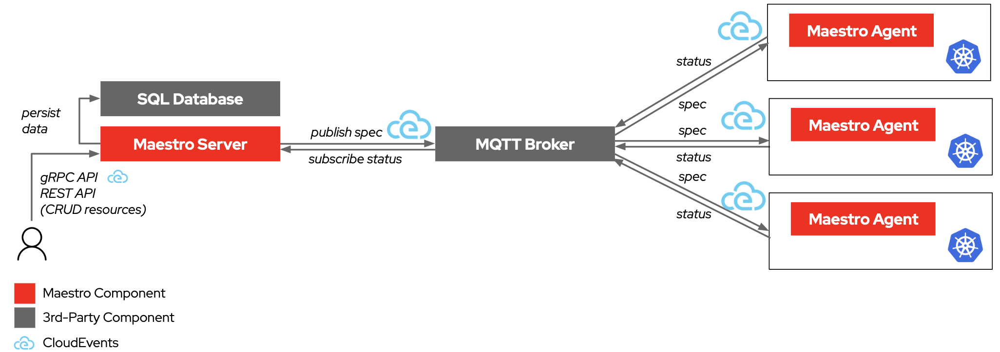

# Maestro

Maestro is a system to leverage [CloudEvents](https://cloudevents.io/) to transport Kubernetes resources to the target clusters, and then transport the resource status back. The resources are stored in a database and the status is updated in the database as well. The system is composed of two parts: the Maestro server and the Maestro agent.
- The Maestro server is responsible for storing the resources and their status. And sending the resources to the message broker in the CloudEvents format. The Maestro server provides Resful APIs and gRPC APIs to manage the resources.
- Maestro agent is responsible for receiving the resources and applying them to the target clusters. And reporting back the status of the resources.

## Architecture

Taking MQTT as an example:



## Why

Maestro was created to address several critical challenges associated with managing Kubernetes clusters at scale.
Traditional Kubernetes native and custom resources rely heavily on etcd,
which has well-known limitations in terms of scalability and performance.
As the number of clusters increases, the strain on etcd can lead to significant issues,
making it difficult to achieve high-scale Kubernetes cluster management.
To overcome these challenges, Maestro introduces a system that leverages a traditional relational database for storing relevant data,
providing a more scalable and efficient solution.

### Motivations

**Scalability**: Kubernetes-based solutions often face scalability issues due to the limitations of etcd.
Maestro aims to overcome these issues by decoupling resource management from the etcd store,
allowing for more efficient handling of a large number of clusters.
This approach supports the goal of managing up to 200,000+ clusters without linear scaling of the infrastructure.

**Cost Effectiveness**: Running a central orchestrator in a Kubernetes-based environment can be costly.
Maestro reduces infrastructure and maintenance costs by leveraging a relational database and optimized content delivery mechanisms.

**Improve Feedback Loop**: Traditional Kubernetes solutions have limitations in the feedback loop,
making it difficult to observe the state of resources effectively.
Maestro addresses this by providing a robust feedback loop mechanism,
ensuring that resource status is continuously updated and monitored.

**Improve Security Architecture**: Maestro enhances security by eliminating the need for kubeconfigs,
reducing the need for direct access to clusters.

## Run for the first time

### Make a build, run postgres and mqtt broker

```sh

# 1. build the project

$ go install gotest.tools/gotestsum@latest  
$ make binary

# 2. run a postgres database locally in docker 

$ make db/setup
$ make db/login
        
    root@f076ddf94520:/# psql -h localhost -U maestro maestro
    psql (14.4 (Debian 14.4-1.pgdg110+1))
    Type "help" for help.
    
    maestro=# \dt
    Did not find any relations.

# 3. run a mqtt broker locally in docker

$ make mqtt/setup
```

### Run database migrations

The initial migration will create the base data model as well as providing a way to add future migrations.

```shell

# Run migrations
./maestro migration

# Verify they ran in the database
$ make db/login

root@f076ddf94520:/# psql -h localhost -U maestro maestro
psql (14.4 (Debian 14.4-1.pgdg110+1))
Type "help" for help.

maestro=# \dt
                 List of relations
 Schema |    Name    | Type  |        Owner        
--------+------------+-------+---------------------
 public | resources  | table | maestro
 public | events     | table | maestro
 public | migrations | table | maestro
(3 rows)


```

### Test the application

```shell

make test
make test-integration
make e2e-test

```

### Running the Service

```shell

make run

```

To verify that the server is working use the curl command:

```shell

curl http://localhost:8000/api/maestro/v1/resources | jq

```

That should return a 401 response like this, because it needs authentication:

```
{
  "kind": "Error",
  "id": "401",
  "href": "/api/maestro/errors/401",
  "code": "API-401",
  "reason": "Request doesn't contain the 'Authorization' header or the 'cs_jwt' cookie"
}
```


Authentication in the default configuration is done through the RedHat SSO, so you need to login with a Red Hat customer portal user in the right account (created as part of the onboarding doc) and then you can retrieve the token to use below on https://console.redhat.com/openshift/token
To authenticate, use the ocm tool against your local service. The ocm tool is available on https://console.redhat.com/openshift/downloads

#### Login to your local service
```
ocm login --token=${OCM_ACCESS_TOKEN} --url=http://localhost:8000

```

#### Get a new Resource
This will be empty if no Resource is ever created

```
ocm get /api/maestro/v1/resources
{
  "items": [],
  "kind": "ResourceList",
  "page": 1,
  "size": 0,
  "total": 0
}
```

#### Create a consumer:

```
ocm post /api/maestro/v1/consumers << EOF
{
  "name": "cluster1"
}
EOF
```

#### Post a new Resource

```shell

ocm post /api/maestro/v1/resources << EOF
{
  "consumer_name": "cluster1",
  "version": 1,
  "manifest": {
    "apiVersion": "apps/v1",
    "kind": "Deployment",
    "metadata": {
      "name": "nginx",
      "namespace": "default"
    },
    "spec": {
      "replicas": 1,
      "selector": {
        "matchLabels": {
          "app": "nginx"
        }
      },
      "template": {
        "metadata": {
          "labels": {
            "app": "nginx"
          }
        },
        "spec": {
          "containers": [
            {
              "image": "nginxinc/nginx-unprivileged",
              "name": "nginx"
            }
          ]
        }
      }
    }
  },
  "manifest_config": {
    "resourceIdentifier": {
      "name": "nginx",
      "namespace": "default",
      "group": "apps",
      "resource": "deployments"
    },
    "updateStrategy": {
      "type": "ServerSideApply"
    }
  },
  "delete_option": {
    "propagationPolicy": "Foreground"
  }
}
EOF

```
delete_option defines the option to delete the resource. It is optional when creating a resource. The propagationPolicy of `delete_option` can be:
- `Foreground` represents that the resource should be fourground deleted. This is a default value.
- `Orphan` represents that the resource is orphaned when deleting the resource.

manifest_config defines the resource identifier (required) and optional update strategy. update strategy defines the strategy to update the resource. It is optional when creating a resource. The type of `update_strategy` can be:
- `ServerSideApply` means to update resource using server side apply with work-controller as the field manager. This is a default value.
- `Update` means to update resource by an update call.
- `CreateOnly` means do not update resource based on current manifest.
- `ReadOnly` means only check the existence of the resource based on the resource's metadata.

#### Get your Resource

```shell
ocm get /api/maestro/v1/resources
{
  "items": [
    {
      "consumer_name": "cluster1",
      "created_at": "2023-11-23T09:26:13.43061Z",
      "delete_option": {
        "propagationPolicy":"Foreground"
      },
      "href": "/api/maestro/v1/resources/f428e21d-71cb-47a4-8d7f-82a65d9a4048",
      "id": "f428e21d-71cb-47a4-8d7f-82a65d9a4048",
      "kind": "Resource",
      "updated_at": "2023-11-23T09:26:13.457419Z",
      "version": 1
      "manifest": {
        "apiVersion": "apps/v1",
        "kind": "Deployment",
        "metadata": {
          "name": "nginx",
          "namespace": "default"
        },
        "spec": {
          "replicas": 1,
          "selector": {
            "matchLabels": {
              "app": "nginx"
            }
          },
          "template": {
            "metadata": {
              "labels": {
                "app": "nginx"
              }
            },
            "spec": {
              "containers": [
                {
                  "image": "nginxinc/nginx-unprivileged",
                  "name": "nginx"
                }
              ]
            }
          }
        }
      },
      "manifest_config": {
        "feedbackRules": [
          {
            "jsonPaths": [
              {
                "name": "status",
                "path": ".status"
              }
            ],
            "type": "JSONPaths"
          }
        ],
        "resourceIdentifier": {
          "group": "apps",
          "name": "nginx",
          "namespace": "default",
          "resource": "deployments"
        },
        "updateStrategy": {
          "type": "ServerSideApply"
        }
      },
      "status": {
        "ContentStatus": {
          "availableReplicas": 1,
          "conditions": [
            {
              "lastTransitionTime": "2023-11-23T07:05:50Z",
              "lastUpdateTime": "2023-11-23T07:05:50Z",
              "message": "Deployment has minimum availability.",
              "reason": "MinimumReplicasAvailable",
              "status": "True",
              "type": "Available"
            },
            {
              "lastTransitionTime": "2023-11-23T07:05:47Z",
              "lastUpdateTime": "2023-11-23T07:05:50Z",
              "message": "ReplicaSet \"nginx-5d6b548959\" has successfully progressed.",
              "reason": "NewReplicaSetAvailable",
              "status": "True",
              "type": "Progressing"
            }
          ],
          "observedGeneration": 1,
          "readyReplicas": 1,
          "replicas": 1,
          "updatedReplicas": 1
        },
        "ReconcileStatus": {
          "Conditions": [
            {
              "lastTransitionTime": "2023-11-23T09:26:13Z",
              "message": "Apply manifest complete",
              "reason": "AppliedManifestComplete",
              "status": "True",
              "type": "Applied"
            },
            {
              "lastTransitionTime": "2023-11-23T09:26:13Z",
              "message": "Resource is available",
              "reason": "ResourceAvailable",
              "status": "True",
              "type": "Available"
            },
            {
              "lastTransitionTime": "2023-11-23T09:26:13Z",
              "message": "",
              "reason": "StatusFeedbackSynced",
              "status": "True",
              "type": "StatusFeedbackSynced"
            }
          ],
          "ObservedVersion": 1,
          "SequenceID": "1744926882802962432"
        }
      }
    }
  ],
  "kind": "",
  "page": 1,
  "size": 1,
  "total": 1
}
```

#### Create/Get resource bundle with multiple resources

1. Enable gRPC server by passing `--enable-grpc-server=true` to the maestro server start command, for example:

```shell
$ oc -n maestro patch deploy/maestro --type=json -p='[{"op": "add", "path": "/spec/template/spec/containers/0/command/-", "value": "--enable-grpc-server=true"}]'
```

2. Port-forward the gRPC service to your local machine, for example:

```shell
$ oc -n maestro port-forward svc/maestro-grpc 8090 &
```

3. Create a resource bundle with multiple resources using the gRPC client, for example:

```shell
go run ./examples/grpc/grpcclient.go -cloudevents_json_file ./examples/grpc/cloudevent-bundle.json -grpc_server localhost:8090
```

4. Get the resource bundle with multiple resources, for example:

```shell
ocm get /api/maestro/v1/resource-bundles
{
  "items": [
    {
      "consumer_name": "cluster1",
      "created_at": "2024-05-30T05:03:08.493083Z",
      "delete_option": {
        "propagationPolicy": "Foreground"
      },
      "href": "/api/maestro/v1/resource-bundles/68ebf474-6709-48bb-b760-386181268060",
      "id": "68ebf474-6709-48bb-b760-386181268060",
      "kind": "ResourceBundle",
      "manifest_configs": [
        {
          "feedbackRules": [
            {
              "jsonPaths": [
                {
                  "name": "status",
                  "path": ".status"
                }
              ],
              "type": "JSONPaths"
            }
          ],
          "resourceIdentifier": {
            "group": "apps",
            "name": "web",
            "namespace": "default",
            "resource": "deployments"
          },
          "updateStrategy": {
            "type": "ServerSideApply"
          }
        }
      ],
      "manifests": [
        {
          "apiVersion": "v1",
          "kind": "ConfigMap",
          "metadata": {
            "name": "web",
            "namespace": "default"
          }
        },
        {
          "apiVersion": "apps/v1",
          "kind": "Deployment",
          "metadata": {
            "name": "web",
            "namespace": "default"
          },
          "spec": {
            "replicas": 1,
            "selector": {
              "matchLabels": {
                "app": "web"
              }
            },
            "template": {
              "metadata": {
                "labels": {
                  "app": "web"
                }
              },
              "spec": {
                "containers": [
                  {
                    "image": "nginxinc/nginx-unprivileged",
                    "name": "nginx"
                  }
                ]
              }
            }
          }
        }
      ],
      "name": "68ebf474-6709-48bb-b760-386181268060",
      "status": {
        "ObservedVersion": 1,
        "SequenceID": "1796044690592632832",
        "conditions": [
          {
            "lastTransitionTime": "2024-05-30T05:03:08Z",
            "message": "Apply manifest work complete",
            "reason": "AppliedManifestWorkComplete",
            "status": "True",
            "type": "Applied"
          },
          {
            "lastTransitionTime": "2024-05-30T05:03:08Z",
            "message": "All resources are available",
            "reason": "ResourcesAvailable",
            "status": "True",
            "type": "Available"
          }
        ],
        "resourceStatus": [
          {
            "conditions": [
              {
                "lastTransitionTime": "2024-05-30T05:03:08Z",
                "message": "Apply manifest complete",
                "reason": "AppliedManifestComplete",
                "status": "True",
                "type": "Applied"
              },
              {
                "lastTransitionTime": "2024-05-30T05:03:08Z",
                "message": "Resource is available",
                "reason": "ResourceAvailable",
                "status": "True",
                "type": "Available"
              },
              {
                "lastTransitionTime": "2024-05-30T05:03:08Z",
                "message": "",
                "reason": "NoStatusFeedbackSynced",
                "status": "True",
                "type": "StatusFeedbackSynced"
              }
            ],
            "resourceMeta": {
              "group": "",
              "kind": "ConfigMap",
              "name": "web",
              "namespace": "default",
              "ordinal": 0,
              "resource": "configmaps",
              "version": "v1"
            },
            "statusFeedback": {}
          },
          {
            "conditions": [
              {
                "lastTransitionTime": "2024-05-30T05:03:08Z",
                "message": "Apply manifest complete",
                "reason": "AppliedManifestComplete",
                "status": "True",
                "type": "Applied"
              },
              {
                "lastTransitionTime": "2024-05-30T05:03:08Z",
                "message": "Resource is available",
                "reason": "ResourceAvailable",
                "status": "True",
                "type": "Available"
              },
              {
                "lastTransitionTime": "2024-05-30T05:03:08Z",
                "message": "",
                "reason": "StatusFeedbackSynced",
                "status": "True",
                "type": "StatusFeedbackSynced"
              }
            ],
            "resourceMeta": {
              "group": "apps",
              "kind": "Deployment",
              "name": "web",
              "namespace": "default",
              "ordinal": 1,
              "resource": "deployments",
              "version": "v1"
            },
            "statusFeedback": {
              "values": [
                {
                  "fieldValue": {
                    "jsonRaw": "{\"availableReplicas\":1,\"conditions\":[{\"lastTransitionTime\":\"2024-05-30T05:03:13Z\",\"lastUpdateTime\":\"2024-05-30T05:03:13Z\",\"message\":\"Deployment has minimum availability.\",\"reason\":\"MinimumReplicasAvailable\",\"status\":\"True\",\"type\":\"Available\"},{\"lastTransitionTime\":\"2024-05-30T05:03:08Z\",\"lastUpdateTime\":\"2024-05-30T05:03:13Z\",\"message\":\"ReplicaSet \\\"web-dcffc4f85\\\" has successfully progressed.\",\"reason\":\"NewReplicaSetAvailable\",\"status\":\"True\",\"type\":\"Progressing\"}],\"observedGeneration\":1,\"readyReplicas\":1,\"replicas\":1,\"updatedReplicas\":1}",
                    "type": "JsonRaw"
                  },
                  "name": "status"
                }
              ]
            }
          }
        ]
      },
      "updated_at": "2024-05-30T05:03:17.796496Z",
      "version": 1
    }
  ],
  "kind": "ResourceBundleList",
  "page": 1,
  "size": 1,
  "total": 1
}
```

#### Run in OpenShift

Take OpenShift Local as an example to deploy the maestro. If you want to deploy maestro in an OpenShift cluster, you need to set the `external_apps_domain` environment variable to point your cluster.
```shell
$ export external_apps_domain=`oc -n openshift-ingress-operator get ingresscontroller default -o jsonpath='{.status.domain}'`
```

Use OpenShift Local to deploy to a local openshift cluster. Be sure to have CRC running locally:

```shell
$ crc status
CRC VM:          Running
OpenShift:       Running (v4.13.12)
RAM Usage:       7.709GB of 30.79GB
Disk Usage:      23.75GB of 32.68GB (Inside the CRC VM)
Cache Usage:     37.62GB
Cache Directory: /home/mturansk/.crc/cache
```

Log into CRC:

```shell
$ make crc/login
Logging into CRC
Logged into "https://api.crc.testing:6443" as "kubeadmin" using existing credentials.

You have access to 66 projects, the list has been suppressed. You can list all projects with 'oc projects'

Using project "ocm-mturansk".
Login Succeeded!
```

Deploy maestro:

We will push the image to your OpenShift cluster default registry and then deploy it to the cluster. You need to follow [this document](https://docs.openshift.com/container-platform/4.13/registry/securing-exposing-registry.html) to expose a default registry manually and login into the registry with podman.

```shell
$ make deploy

$ oc get pod -n maestro-root
NAME                            READY   STATUS      RESTARTS   AGE
maestro-85c847764-4xdt6         1/1     Running     0          62s
maestro-db-1-deploy             0/1     Completed   0          62s
maestro-db-1-kwv4h              1/1     Running     0          61s
maestro-mqtt-6cb7bdf46c-kcczm   1/1     Running     0          63s
```

Create a consumer:

```shell
$ ocm login --token=${OCM_ACCESS_TOKEN} --url=https://maestro.${external_apps_domain} --insecure

$ ocm post /api/maestro/v1/consumers << EOF
{
  "name": "cluster1"
}
EOF

{
  "created_at":"2023-12-08T11:35:08.557450505Z",
  "href":"/api/maestro/v1/consumers/3f28c601-5028-47f4-9264-5cc43f2f27fb",
  "id":"3f28c601-5028-47f4-9264-5cc43f2f27fb",
  "kind":"Consumer",
  "name":"cluster1",
  "updated_at":"2023-12-08T11:35:08.557450505Z"
}

```

Deploy maestro agent:

```shell
$ export consumer_name=cluster1
$ make deploy-agent
$ oc get pod -n maestro-agent-root
NAME                             READY   STATUS    RESTARTS   AGE
maestro-agent-5dc9f5b4bf-8jcvq   1/1     Running   0          13s
```

Create a resource:
```shell
$ ocm post /api/maestro/v1/resources << EOF
{
  "consumer_name": "cluster1",
  "version": 1,
  "manifest": {
    "apiVersion": "apps/v1",
    "kind": "Deployment",
    "metadata": {
      "name": "nginx",
      "namespace": "default"
    },
    "spec": {
      "replicas": 1,
      "selector": {
        "matchLabels": {
          "app": "nginx"
        }
      },
      "template": {
        "metadata": {
          "labels": {
            "app": "nginx"
          }
        },
        "spec": {
          "containers": [
            {
              "image": "nginxinc/nginx-unprivileged",
              "name": "nginx"
            }
          ]
        }
      }
    }
  },
  "manifest_config": {
    "resourceIdentifier": {
      "name": "nginx",
      "namespace": "default",
      "group": "apps",
      "resource": "deployments"
    }
  }
}
EOF
```
You should be able to see the pod is created in default namespace.
```shell
$ oc get pod -n default
NAME                     READY   STATUS    RESTARTS   AGE
nginx-5d6b548959-829c7   1/1     Running   0          70s
```
## Make a new Kind

1. Add to openapi.yaml
2. Generate the new structs/clients (`make generate`)

## Configure maestro server

### MQTT Configuration

Using the `--mqtt-config-file` to specify the MQTT configuration file for maestro server, the format of the configuration file can be yaml or json, it contains the following configurations

```yaml
brokerHost: <MQTT broker host, e.g. 127.0.0.1:1883>
username: <the username for MQTT broker, if required by username and password authentication>
password: <the password for MQTT broker, if required by username and password authentication>
caFile: <the CA of the MQTT broker, if required by mTLS authentication>
clientCertFile: <the cert of the MQTT client, if required by mTLS authentication>
clientKeyFile: <the cert key of the MQTT client, if required by mTLS authentication>
topics:
  sourceEvents: sources/maestro/consumers/+/sourceevents
  agentEvents: <the topic for agent events>
```

For `topics.agentEvents`

- If the MQTT broker supports the [shared subscriptions](
https://docs.oasis-open.org/mqtt/mqtt/v5.0/os/mqtt-v5.0-os.html#_Toc3901250), the topic needs to be set to `$share/statussubscribers/sources/maestro/consumers/+/agentevents`
- If the MQTT broker does not support the shared subscriptions, the topic needs to be set to `sources/maestro/consumers/+/agentevents` and set the maestro server flag `--subscription-type` to `broadcast`
