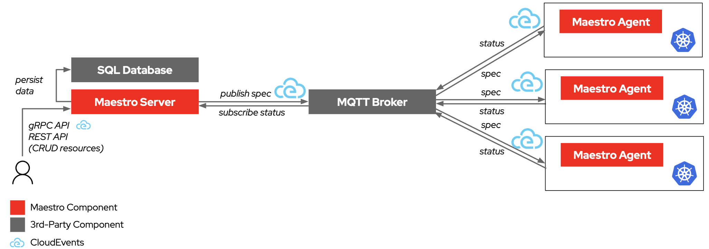
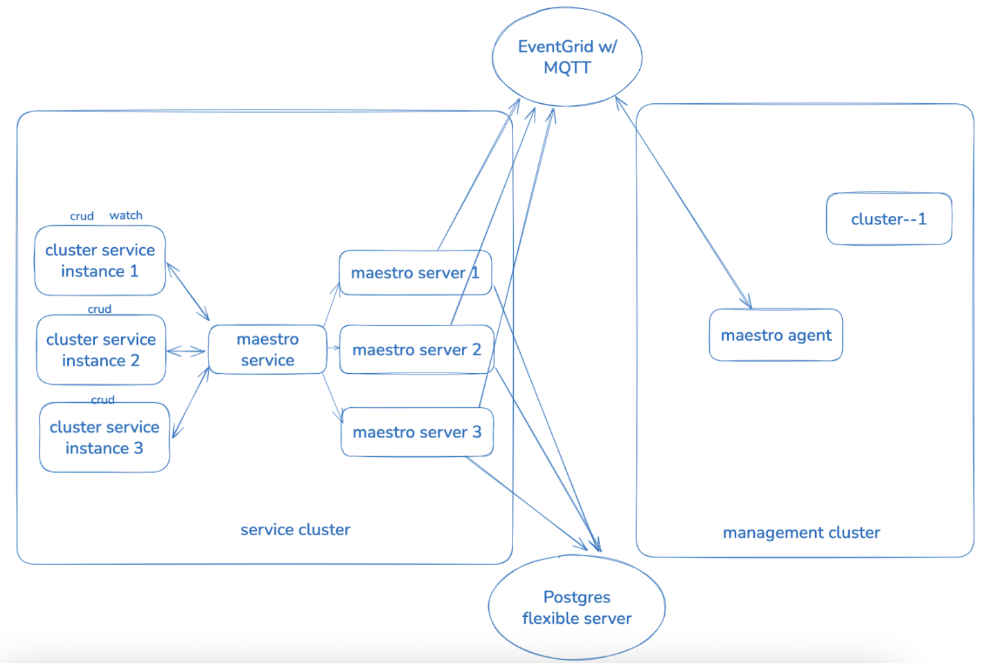

# Maestro Service Architecture

This document delineates the architecture of the Maestro service, encompassing its purpose, critical components, dependencies, and serves as the foundational document for subsequent production readiness tasks.

## Service Description

Maestro is a system engineered to utilize CloudEvents for transporting Kubernetes resources to designated clusters and subsequently relaying resource status feedback. The system persists resource and status data within a database.

The system is composed of two primary components:

* Maestro server: Responsible for data persistence of resources and their status. It transmits resources to a message broker in CloudEvents format. The server exposes RESTful and gRPC APIs for resource management.
* Maestro agent: Responsible for receiving resources and deploying them to the target clusters, along with reporting resource status.



Maestro was developed to address significant challenges associated with large-scale Kubernetes cluster management. Conventional solutions reliant upon etcd exhibit scalability and performance limitations with an increasing number of clusters. Maestro mitigates these limitations by employing a traditional relational database for data storage, thus providing a more scalable and efficient solution. The motivation includes the achievement of scalability, cost-effectiveness, enhanced feedback mechanisms, and improved security architecture.

## Service Role in ARO HCP

In ARO HCP, the maestro service is designed to transfer resources such as managed clusters, Hypershift, and namespaces from the service cluster to the management cluster. And report back the resource status from the management clusters to the service cluster. Meanwhile, the maestro service is also used to fetch the secret content from the management clusters to the service cluster.



From above chart, we can see that the external dependencies are:

* Postgres flexible server
* EventGrid with MQTT enabled

## Owning Team Contact Information

Team lead/manager: Chunlin Yang/Yuanyuan He

Slack channel: #team-maestro

## SLI/SLO of Maestro Server

### Maestro Server Availability

**SLI**: Maestro server availability \
**SLO**: Maintain at least 90% availability of the maestro server over a 28-day period (10% error budget) \
**Suggest Alert**:
* **Expression**:**Name**: Maestro Server Availability Drop
* **Description**: Maestro server availability has fallen below 90% over the last 28 days.
* **Expression**:

  ```promQL
  (
    sum_over_time(kube_deployment_status_replicas_available{deployment="maestro"}[28d])
    /
    sum_over_time(kube_deployment_spec_replicas{deployment="maestro"}[28d])
  ) < 0.90
  ```

**Runbook:**

1. Check maestro replica status to understand the health and state of individual pods.

    ```shell
    kubectl get deployment maestro -n maestro
    kubectl describe deployment maestro -n maestro
    kubectl get pods -l app=maestro -n maestro
    # Confirm the AVAILABLE vs DESIRED replicas.
    # Look for pods stuck in Pending, CrashLoopBackOff, or ImagePullBackOff.
    ```

2. Check recent maestro pod events related to the maestro pods or deployment.

    ```shell
    kubectl get events -n maestro --sort-by=.lastTimestamp
    # Look for scheduling issues, image pull errors, OOMKills, etc.
    ```
3. Inspect maestro pod logs for any maestro itself issues or crashes.

    ```shell
    kubectl logs deploy/maestro -n maestro
    # Check for application-level errors or startup failures.
    ```
4. Check node and scheduling health to ensure the nodes running maestro server are healthy and have resources.

    ```shell
    kubectl get nodes
    kubectl describe node <node-name>
    # Identify if maestro server pods are affected by node pressure, taints, or evictions.
    ```

### Advisory Lock Duration

**SLI**: Advisory lock durations in seconds (`advisory_lock_duration`) \
**SLO**: 99% of advisory locks are released within 500ms** \
**Suggest Alert**:
* **Expression**:**Name**: Long-Duration Advisory Lock
* **Description**: Over the past 5 minutes, less than 99% of advisory locks are released within 500ms.
* **Expression**:

  ```promQL
  (
    sum(rate(advisory_lock_duration_bucket{status="OK",le="0.5"}[5m]))
    /
    sum(rate(advisory_lock_duration_count{status="OK"}[5m]))
  ) < 0.99
  ```

**Runbook:**

1. Identify the types the advisory lock operates on with high duration.

    ```shell
    # Query which type the advisory lock operates on take >500ms:
    sort_desc(
      sum by (type) (
        rate(advisory_lock_duration_bucket{status="OK",le="+Inf"}[5m])
        - ignoring(le)
        rate(advisory_lock_duration_bucket{status="OK",le="0.5"}[5m])
      )
    )

    # Results is a list like:
    type     | value  
    -------------+------+--------
    {type="resources"} | 0.015
    {type="events"}    | 0
    {type="instances"} | 0

    # This tells you the rate of advisory lock operates longer than 0.5s, grouped by type, sorted from highest to lowest, value 0 means no long duration lock for that type.
    ```

2. If lock on "instances" takes longer, try to increase the heartbeat interval for maestro deployment.

    ```shell
    kubectl -n maestro edit deployment maestro

    # Then find spec.template.spec.containers → the container named service
    # Under it, set or update the command list for heartbeat-interval to 30 seconds(default 15s) , like:

        containers:
            - name: service
            image: maestro-image
            command:
                - /usr/local/bin/maestro
                - server
                - --heartbeat-interval=30

    # Save and exit. Kubernetes will automatically restart the pod with the new command.
    ```

3. Otherwise, check the current maestro connections to postgresql and state to check if there are any uncommitted or aborted transactions.

    ```shell
    SELECT state, count(*) 
      FROM pg_stat_activity 
      WHERE usename = 'maestro'
      GROUP BY state;

    # This will output something like:
                state              | count 
    --------------------------------+-------
    active                        |     2
    idle                          |     5
    idle in transaction           |     1
    idle in transaction (aborted) |     1
    (4 rows)

    - `active` state means session is actively running a query.
    - `idle` state means session is connected but doing nothing.
    - `idle in transaction` state means a transaction has been opened but is idle — a potential issue.
    - `idle in transaction (aborted)` means a transaction was rolled back or errored but not closed — should be fixed.
    ```

4. For high-throughput maestro servers, review postgresql connection pool settings — high contention may indicate an insufficient number of connections.

    ```shell
    kubectl -n maestro get deployment maestro -o jsonpath="{.spec.template.spec.containers[?(@.name=='service')].command}"

    # This will output something like:
    [--db-max-open-connections=50]

    # Try to set max db connections to a bigger value, eg, 100.
    ```

### Advisory Lock Release Rate (Alpha)

**SLI**: Ratio of advisory locks released (advisory_unlock_count) to locks acquired (advisory_lock_count) \
**SLO**: At least 99% of advisory locks acquired are released within the measured time (5-minute) window \
**Suggest Alert**:
* **Name**: Advisory Lock Release Rate Drop
* **Description**: Less than 99% of advisory locks are released/unlocked (aggregated across all types)
* **Note:** This is sensitive to resource request and metrics scrape frequencies. To avoid false alerts, use a longer pending time and evaluate multiple times before firing.
* **Expression**:

  ```promQL
    (
      sum (rate(advisory_unlock_count{status="OK"}[5m]))
      /
      sum (rate(advisory_lock_count{status="OK"}[5m]))
    ) < 0.99
  ```

**Runbook:**

1. Identify active or idle transactions by the maestro that have been open for a long time.

    ```shell
    SELECT pid, usename, state, now() - xact_start AS age, query
        FROM pg_stat_activity
        WHERE xact_start IS NOT NULL
            AND usename = 'maestro'
        ORDER BY age DESC;

    # This will output something like:
    pid  | usename |   state   |    age    |          query
    ------+---------+-----------+-----------+--------------------------
    1234 | maestro | idle in transaction | 00:45:12 | SELECT from resources ...
    5678 | maestro | active    | 00:02:14 | INSERT INTO events ...

    - xact_start: Time when the transaction started.
    - age: How long the transaction has been running or idle.
    - state: Session state — e.g., active, idle in transaction, etc.
    - query: The SQL query that initiated the transaction.

    # Run the above query multiple times, check if there are long-running idle transactions from maestro for each query
    ```

2. If no long running query transactions, check if there is maestro stuck or failure in logs.

    ```shell
    kubectl -n maestro logs -l app=maestro -c maestro --tail=100

    # Try to look for:
    - Connection pool exhaustion (e.g., too many connections)
    - Database transaction errors
    - Panic or runtime errors
    - Deadlocks or timeouts
    ```

### gRPC Server Call Duration

**SLI**: gRPC server call duration (`grpc_server_processed_duration_seconds`) \
**SLO**: 99% of gRPC requests are completed in 500ms \
**Suggest Alert**:
* **Name**: High gRPC Call Duration
* **Description**: Less than 99th percentile gRPC duration shorter than 500ms over the past 5 minutes.
* **Expression**:

  ```promQL
  (
    sum(rate(grpc_server_processed_duration_seconds_bucket{le="0.5"}[5m]))
    /
    sum(rate(grpc_server_processed_duration_count[5m]))
  ) < 0.99
  ```

**Runbook:**

1. Check the current maestro connections to postgresql and state to check if there are any uncommitted or aborted transactions.

    ```shell
    SELECT state, count(*) 
        FROM pg_stat_activity 
        WHERE usename = 'maestro'
        GROUP BY state;

    # This will output something like:
                state              | count 
    --------------------------------+-------
    active                        |     2
    idle                          |     5
    idle in transaction           |     1
    idle in transaction (aborted) |     1
    (4 rows)

    - `active` state means session is actively running a query.
    - `idle` state means session is connected but doing nothing.
    - `idle in transaction` state means a transaction has been opened but is idle — a potential issue.
    - `idle in transaction (aborted)` means a transaction was rolled back or errored but not closed — should be fixed.
    ```

2. For high-throughput maestro servers, review postgresql connection pool settings — high contention may indicate an insufficient number of connections.

    ```shell
    kubectl -n maestro get deployment maestro -o jsonpath="{.spec.template.spec.containers[?(@.name=='service')].command}"

    # This will output something like:
    [--db-max-open-connections=50]
    # Try to set max db connections to a bigger value, eg, 100.
    ```

### Resource Spec Resync Duration (Alpha)

**SLI**: Resource spec resync duration (`resources_spec_resync_duration_seconds`) \
**SLO**: 99% of resource spec resyncs complete within 10 seconds \
**Suggest Alert**:
* **Name**: Resource Spec Resync Too Slow
* **Description**: Less than 99th percentile resource spec resync duration shorter than 10s over the past 5 minutes.
* **Expression**:

  ```promQL
  (
    sum(rate(resources_spec_resync_duration_seconds_bucket{le="10.0"}[5m]))
    /
    sum(rate(resources_spec_resync_duration_count[5m]))
  ) < 0.99
  ```

**Runbook:**

1. To monitor the postgresql database, check both the quantity and size of the resources.

    ```shell
    SELECT 
        count(*) AS total_resources,
        sum(pg_column_size(payload)) AS total_payload_bytes,
        pg_size_pretty(sum(pg_column_size(payload))) AS total_payload_pretty
    FROM resources;
    ```

2. Inspect maestro logs to determine if prolonged spec resync times are due to errors when sending data to the MQTT broker (EventGrid in ARO).

    ```shell
    kubectl -n maestro logs deploy/maestro | grep -E "(Failed to publish|Failed to send)" | tail-20
    ```

3. Review MQTT broker (Event Grid in Azure) metrics/logs to verify the functionality of current maestro-mqtt connections.

    ```shell
    # For instance, in ARO, navigate to EventGrid | Namespaces > Monitoring -> Metrics. If possible, examine the "Failed Publish Events" and "MQTT: Dropped Sessions" metrics and drill down into the logs for further error information if needed.
    ```

4. Check the current maestro connections to postgresql and state to check if there are any uncommitted or aborted transactions.

    ```shell
    SELECT state, count(*) 
        FROM pg_stat_activity 
        WHERE usename = 'maestro'
        GROUP BY state;

    # This will output something like:
                state              | count 
    --------------------------------+-------
    active                        |     2
    idle                          |     5
    idle in transaction           |     1
    idle in transaction (aborted) |     1
    (4 rows)

    - `active` state means session is actively running a query.
    - `idle` state means session is connected but doing nothing.
    - `idle in transaction` state means a transaction has been opened but is idle — a potential issue.
    - `idle in transaction (aborted)` means a transaction was rolled back or errored but not closed — should be fixed.
    ```

5. For high-throughput maestro servers, review postgresql connection pool settings — high contention may indicate an insufficient number of connections.

    ```shell
    kubectl -n maestro get deployment maestro -o jsonpath="{.spec.template.spec.containers[?(@.name=='service')].command}"

    # This will output something like:
    [--db-max-open-connections=50]
    # Try to set max db connections to a bigger value, eg, 100.
    ```

### REST API Latency

**SLI**: REST API request durations (`rest_api_inbound_request_duration`) \
**SLO**: 99% of API requests finish within 1s \
**Suggest Alert**:
* **Name**: API Slow Response
* **Description**: Less than 99th percentile rest API requests are completed within 1s over the past 5 minutes.
* **Expression**:

  ```promQL
  (
    sum(rate(rest_api_inbound_request_duration_bucket{le="1.0"}[5m]))
    /
    sum(rate(rest_api_inbound_request_duration_count[5m]))
  ) < 0.99
  ```

**Runbook:**

1. Pinpointing the bottleneck in REST API response times.

    ```shell
    # Query which endpoint the rest API called to that takes > 1s:
    sort_desc(
        sum by (path) (
            rate(rest_api_inbound_request_duration_bucket{le="+Inf"}[5m])
            - ignoring(le)
            rate(rest_api_inbound_request_duration_bucket{le="1.0"}[5m])
        )
    )

    # Results is a list like:
    path     | value  
    -------------+------+--------
    {path="/api/maestro/v1/resource-bundles/-"} | 0.015
    {path="/api/maestro/v1/resource-bundles"}   | 0

    # This tells you the rate of rest API request longer than 1s, grouped by path, sorted from highest to lowest, value 0 means no long rest API request for that path.
    ```

2. Resource bundle list operations typically experience slow performance, check the number of resources in the postgresql database and the size of resources within the database.

    ```shell
    SELECT 
        count(*) AS total_resources,
        sum(pg_column_size(payload)) AS total_payload_bytes,
        pg_size_pretty(sum(pg_column_size(payload))) AS total_payload_pretty
    FROM resources;
    ```

3. When requesting a resource bundle list, especially for large quantities or sizes of resources, consider setting a smaller return size than the default of 100 records.

    ```shell
    # For instance, request resource bundles with 10 resources each time
    curl ${MAESTRO_HOST}/api/maestro/v1/resource-bundles?size=10
    ```

### Rest API Request Success Ratio

**SLI**：REST API request unsuccess ratio (rest_api_inbound_request_count) \
**SLO**: More than 99% successful rest API request ratio \
**Suggest Alert:**
* **Name**: Too many unsuccessful API requests
* **Description**: More than 1% of API requests failed over the past 5 minutes.
* **Expression**:

  ```promQL
  (
    sum(rate(rest_api_inbound_request_count{code=~"5.."}[5m]))
    /
    sum(rate(rest_api_inbound_request_count[5m]))
  ) > 0.01
  ```

**Runbook:**

1. Confirm maestro server operational status by verifying that all maestro pods are running without crashing.

    ```shell
    kubectl -n maestro get pods -l app=maestro
    ```

2. If the maestro server is operating without crashes or panics, review its logs for outstanding errors that indicate improper functioning.

    ```shell
    kubectl -n maestro logs deploy/maestro | grep -E "(Failed|failed|Error|error)
    ```

## SLI/SLO of Maestro Agent

### Maestro Agent Availability

**SLI**: Maestro agent availability \
**SLO**: Maintain at least 90% availability of the maestro agent over a 28-day period (10% error budget) \
**Suggest Alert**:
* **Name**: Maestro Agent Availability Drop
* **Description**: Maestro agent availability has fallen below 90% over the last 28 days.
* **Expression**:

  ```promQL
  (
    sum_over_time(kube_deployment_status_replicas_available{deployment="maestro-agent"}[28d])
    /
    sum_over_time(kube_deployment_spec_replicas{deployment="maestro-agent"}[28d])
  ) < 0.90
  ```

**Runbook:**

1. Check maestro agent replica status to understand the health and state of individual pods.

    ```shell
    kubectl get deployment maestro-agent -n maestro
    kubectl describe deployment maestro-agent -n maestro
    kubectl get pods -l app=maestro-agent -n maestro

    # Confirm the AVAILABLE vs DESIRED replicas.
    # Look for pods stuck in Pending, CrashLoopBackOff, or ImagePullBackOff.
    ```

2. Check recent maestro agent pod events related to the maestro agent pods or deployment.

    ```shell
    kubectl get events -n maestro --sort-by=.lastTimestamp
    # Look for scheduling issues, image pull errors, OOMKills, etc.
    ```

3. Inspect maestro agent pod logs for any maestro itself issues or crashes.

    ```shell
    kubectl logs deploy/maestro-agent -n maestro
    # Check for application-level errors or startup failures.
    ```

4. Check node and scheduling health to ensure the nodes running maestro agent are healthy and have resources.

    ```shell
    kubectl get nodes
    kubectl describe node <node-name>
    # Identify if maestro agent pods are affected by node pressure, taints, or evictions.
    ```

### REST Client Latency

**SLI**: REST client request duration (rest_client_request_duration_seconds) \
**SLO**: 99% of client requests complete within 500ms \
**Suggest Alert**:
* **Name**: High REST Client Latency
* **Description**: Less than 95th percentile REST client requests are completed within 500ms over the past 5 minutes.
* **Expression**:

  ```promQL
  (
    sum(rate(rest_client_request_duration_seconds_bucket{le="0.5"}[5m]))
    /
    sum(rate(rest_client_request_duration_count[5m]))
  ) < 0.99
  ```

**Runbook:**

1. Identify the slow host and verb of the rest client requests.

    ```shell
    # Query which endpoint the rest client called to that takes > 0.5s:
    sort_desc(
        sum by (host, verb) (
            rate(rest_client_request_duration_seconds_bucket{le="+Inf"}[5m])
            - ignoring(le)
            rate(rest_client_request_duration_seconds_bucket{le="0.5"}[5m])
        )
    )

    # Results is a list like:
    host     | verb | value  
    -------------+------+--------
    10.96.0.1:443 | POST | 0.025
    [::1]:6443    | PUT  | 0.018
    10.96.0.1:443 | GET  | 0.012
    [::1]:6443    | GET  | 0.000

    # This tells you the rate of requests per second slower than 0.5s, grouped by host and verb, sorted from highest to lowest, value 0 means no slow requests observed for that host+verb.
    ```

2. Enable detailed HTTP tracing by setting the log verbosity: use the debugging round tripper which provides detailed timing breakdown including DNS lookup, connection establishment, TLS handshake, and server processing times.

    ```shell
    # Note: This will cause the Maestro agent to restart, which may result in lost previous logs and make some issues unreproducible.

    kubectl -n maestro edit deploy/maestro-agent

    # Then find spec.template.spec.containers → the container named service
    # Under it, set or update the command list for log verbosity , like:

        containers:
            - name: maestro-agent
            image: maestro-image
            command:
                - /usr/local/bin/maestro
                - agent
                - --v=4

    --v=4  # Basic request error logging
    --v=6  # URL timing information
    --v=9  # Full detailed HTTP tracing including timing breakdowns

    # Save and exit. Kubernetes will automatically restart the pod with the new command.
    ```

### REST Client Request Error Rate

**SLI**: Number of HTTP requests partitioned by status (rest_client_requests_total) \
**SLO**: At least 95% of requests must be successful (status code 2xx) \
**Suggest Alert**:
* **Name**: High REST Client Error Rate
* **Description**: &lt;95% of client HTTP requests returned 2xx
* **Expression:**

  ```promQL
  (
    sum(rate(rest_client_requests_total{code=~"2.."}[5m]))
    /
    sum(rate(rest_client_requests_total[5m]))
  ) < 0.95
  ```

**Runbook:**

1. Identify the host, verb and method for the high error rate of the rest client requests:

    ```shell
    # Find top error-producing endpoints
    topk(10, sum by (host, method) (
        rate(rest_client_requests_total{code!~"2.."}[5m])
    ))

    # This will output a list like:
        host      | method |  value  
    ---------------+--------+---------
    [::1]:6443     | POST   | 0.042
    10.96.0.1:443  | PUT    | 0.035
    10.96.0.1:443  | PATCH  | 0.012
    [::1]:6443     | GET    | 0
    172.18.0.2:6443| DELETE | 0

    # This tells you the top 10 host + method pairs with the highest rate of non-2xx (error) requests in the last 5 minutes. Each value is the error rate in requests/sec. Higher means more frequent failures.
    ```

2. Drill down the REST client request metrics using PromQL, categorized by status code.

    ```shell
    sum by (code, host, method) (
        rate(rest_client_requests_total{method="POST", host="10.96.0.1:443"}[5m])
    )
    ```

3. Analyze error patterns by checking the logs and understand how errors are categorized:

    ```shell
    # Check maestro logs for error patterns
    kubectl -n maestro logs deploy/maestro-agent | grep -E "(HTTP|error|failed)" | head -20

    # Look for specific error codes in logs
    kubectl -n maestro logs deploy/maestro-agent | grep -E "status.*[45][0-9][0-9]"

    # Check for connection errors
    kubectl -n maestro logs deploy/maestro-agent | grep -E "(connection.*reset|EOF|timeout)"
    ```

### Workqueue Latency

**SLI**: Time an item stays in the queue (workqueue_queue_duration_seconds) \
**SLO**: 99% of items are dequeued within 1 second \
> Note: The time value (in SLO) depends on the number of resources. We need a reference value from the ARO environment, ideally from the maestro agent with the largest number of resources.
**Suggest Alert**:
* **Name**: High Workqueue Queue Duration
* **Description**: Less than 99th percentile of queue items are dequeued within 1 second over the past 5 minutes.
* **Expression**:

  ```promQL
  (
    sum(rate(workqueue_queue_duration_seconds_bucket{le="1.0"}[5m]))
    /
    sum(rate(workqueue_queue_duration_count[5m]))
  ) < 0.99
  ```

**Runbook:**

1. Identify which workqueues have high queue latency:

    ```shell
    # Find workqueues with high 99th percentile queue duration
    histogram_quantile(0.99, rate(workqueue_queue_duration_seconds_bucket[5m])) > 1
    
    # Break down by workqueue name to identify specific slow queues
    histogram_quantile(0.99, rate(workqueue_queue_duration_seconds_bucket[5m])) by (name) > 1
    
    # Check average queue duration across all workqueues
    sum by (name) (rate(workqueue_queue_duration_seconds_sum[5m])) / sum by (name) (rate(workqueue_queue_duration_seconds_count[5m]))
    ```

2. Check workqueue depth and backlog:

    ```shell
    # Monitor current queue depth (items waiting to be processed)
    workqueue_depth by (name)
    
    # Check if items are being added faster than processed
    rate(workqueue_adds_total[5m]) by (name) - rate(workqueue_queue_duration_seconds_count[5m]) by (name)
    
    # Monitor retry patterns that could cause queue buildup 
    rate(workqueue_retries_total[5m]) by (name)
    ```

3. Analyze processing capacity vs demand:

    ```shell
    # Monitor add rate vs processing completion rate
    workqueue_adds_total|workqueue_queue_duration_seconds_count
    ```

4. Check for processing bottlenecks:

    ```shell
    # Compare queue duration vs work duration to identify bottlenecks
    histogram_quantile(0.99, rate(workqueue_queue_duration_seconds_bucket[5m])) by (name) / histogram_quantile(0.99, rate(workqueue_work_duration_seconds_bucket[5m])) by (name)
    
    # Monitor work duration to see if slow processing is causing queue buildup
    histogram_quantile(0.99, rate(workqueue_work_duration_seconds_bucket[5m])) by (name)
    ```

### Workqueue Processing Time

**SLI**: Time taken to process an item (workqueue_work_duration_seconds) \
**SLO**: 99% of items are processed within 1 second \
**Suggest Alert**:
* **Name**: Long Workqueue Processing Time
* **Description**: Less than 99th percentile of workqueue items within 1 second over the past 5 minutes.
* **Expression**:

  ```promQL
  (
    sum(rate(workqueue_work_duration_seconds_bucket{le="1.0"}[5m]))
    /
    sum(rate(workqueue_work_duration_count[5m]))
  ) < 0.99
  ```

**Runbook:**

1. Identify which workqueues have slow processing:

    ```shell
    # Find workqueues with high 99th percentile processing time
    histogram_quantile(0.99, rate(workqueue_work_duration_seconds_bucket[5m])) > 1
    
    # Break down by workqueue name to identify specific slow queues
    histogram_quantile(0.99, rate(workqueue_work_duration_seconds_bucket[5m])) by (name) > 1
    
    # Check current processing times across all workqueues
    sum by (name) (rate(workqueue_work_duration_seconds_sum[5m])) / sum by (name) (rate(workqueue_work_duration_seconds_count[5m]))
    ```

2. Check for stuck or long-running processors:

    ```shell
    # Monitor unfinished work seconds - shows cumulative processing time for items currently being worked on
    workqueue_unfinished_work_seconds by (name)
    
    # Check longest running processor - shows how long the slowest processor has been running
    workqueue_longest_running_processor_seconds by (name)
    
    # Find workqueues with high unfinished work (potential stuck threads)
    workqueue_unfinished_work_seconds > 10
    
    # Identify workqueues with processors running longer than expected
    workqueue_longest_running_processor_seconds > 30
    
    # Rate of increase in unfinished work (indicates accumulating stuck work)
    rate(workqueue_unfinished_work_seconds[5m]) by (name)
    ```

### Workqueue Retries

**SLI**: Total number of workqueue retries (workqueue_retries_total) \
**SLO**: Retry rate should remain low (e.g., &lt;1% of total adds) \
**Suggest Alert**:
* **Name**: High Workqueue Retry Rate
* **Description**: More than 1% of workqueue ads are being retried
* **Expression**:

  ```promQL
  (
    sum(rate(workqueue_retries_total[5m]))
    /
    sum(rate(workqueue_adds_total[5m]))
  ) > 0.01
  ```

**Runbook:**

1. Identify which workqueues have high retry rates:

    ```shell
    # Find top retry-producing workqueues
    topk(10, sum by (name) (rate(workqueue_retries_total[5m])))

    This will output a list like this:
    Element | name                         | Value
    --------|------------------------------|--------
    1       | AvailableStatusController    | 0.106
    2       | AppliedManifestWorkFinalizer | 0.013

    # The tells you the per-second retry rate over 5 minutes for each workqueue (grouped by name) and returns the top 10 with the highest retry rates.
    ```

2. Analyze controller reconciliation patterns. The retry mechanism is typically triggered when controllers encounter errors during reconciliation.When an error occurs, items are added back to the queue with rate limiting.

    ```shell
    # Check controller reconciliation errors
    kubectl -n maestro logs deploy/maestro-agent | grep -E "(Reconciler error|reconcile.*error)" | tail -20
    ```

3. Analyze underlying causes from logs:

    ```shell
    # Check for resource conflicts or API server issues
    kubectl -n maestro logs deploy/maestro-agent | grep -E "(conflict|timeout|connection.*reset)" | tail -20
    
    # Monitor for specific error patterns that cause retries
    kubectl -n maestro logs deploy/maestro-agent | grep -E "(failed to.*update|failed to.*create|failed to.*delete)" | tail-20
    
    # Check for rate limiting from API server
    kubectl -n maestro logs deploy/maestro-agent | grep -E "(429|too.*many.*requests|throttl)" | tail-10
    ```
