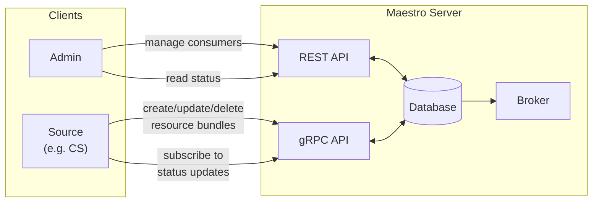

# Maestro Client Guide

This guide describes how to use Maestro's APIs to manage resources on target consumers (clusters).

## Architecture Overview

For detailed internal architecture and data flows, see [Maestro Overview](./maestro.md).



## Client Libraries

### REST API Client (OpenAPI-generated)

**Package:** `github.com/openshift-online/maestro/pkg/api/openapi`

```go
import "github.com/openshift-online/maestro/pkg/api/openapi"

client := openapi.NewAPIClient(cfg)

// Consumers
client.DefaultAPI.ApiMaestroV1ConsumersGet(ctx)         // List
client.DefaultAPI.ApiMaestroV1ConsumersIdGet(ctx, id)   // Get
client.DefaultAPI.ApiMaestroV1ConsumersPost(ctx)        // Create
client.DefaultAPI.ApiMaestroV1ConsumersIdPatch(ctx, id) // Update
client.DefaultAPI.ApiMaestroV1ConsumersIdDelete(ctx, id)// Delete

// Resource Bundles (read-only + delete)
client.DefaultAPI.ApiMaestroV1ResourceBundlesGet(ctx)         // List
client.DefaultAPI.ApiMaestroV1ResourceBundlesIdGet(ctx, id)   // Get (includes status)
client.DefaultAPI.ApiMaestroV1ResourceBundlesIdDelete(ctx, id)// Delete
```

### gRPC Client (for sending resources + watching status)

**Package:** `github.com/openshift-online/maestro/pkg/client/cloudevents/grpcsource`

For a complete working example, see [examples/manifestwork](../examples/manifestwork/). For gRPC authentication setup (mTLS or token-based), see [gRPC Authentication](./maestro.md#authentication-and-authorization).

```go
import "github.com/openshift-online/maestro/pkg/client/cloudevents/grpcsource"

// Returns a workv1client.WorkV1Interface (standard OCM ManifestWork client)
workClient, err := grpcsource.NewMaestroGRPCSourceWorkClient(
    ctx,
    logger,
    apiClient,  // the openapi client (used internally for watching)
    grpcOpts,   // gRPC connection options
    sourceID,
)

// Then use it like a regular ManifestWork client
workClient.ManifestWorks(clusterName).Create(ctx, manifestWork, metav1.CreateOptions{})
workClient.ManifestWorks(clusterName).Update(ctx, manifestWork, metav1.UpdateOptions{})
workClient.ManifestWorks(clusterName).Delete(ctx, name, metav1.DeleteOptions{})
workClient.ManifestWorks(clusterName).Watch(ctx, metav1.ListOptions{})  // streams status updates
```

## Consumer Lifecycle

A **Consumer** represents a target cluster. You must create a consumer before sending resources to it.

1. **Create consumer** via REST API (provides consumer name/ID)
2. **Agent connects** using that consumer name
3. **Send resources** via gRPC, specifying the consumer name as the target
4. **Delete consumer** when the cluster is decommissioned (resources are cleaned up)

```go
// 1. Create consumer via REST
consumer, _, _ := client.DefaultAPI.ApiMaestroV1ConsumersPost(ctx).
    Consumer(openapi.Consumer{Name: openapi.PtrString("my-cluster")}).
    Execute()

// 2. Send resources via gRPC to that consumer
workClient.ManifestWorks(*consumer.Name).Create(ctx, manifestWork, metav1.CreateOptions{})
```

## Key Concepts

### Resource Bundles and ManifestWorks

- Maestro only supports **ResourceBundles**, not single resources
- **ManifestWork** is the Kubernetes CR representation of a ResourceBundle
- A ResourceBundle can contain one or more Kubernetes manifests
- FeedbackRules can be defined inside the ManifestWork to extract data from applied resources. They are calculated by the agent and reported as part of the status.

### ManifestWork Structure

For detailed create/update/delete flow diagrams, see [Resource Flows](./maestro.md#maestro-resource-flow).

```
ManifestWork
├── metadata.generation              ← MW spec version (you set this)
├── spec.workload.manifests[]        ← The K8s resources
├── spec.manifestConfigs[]           ← Feedback rules
└── status
    ├── conditions[]
    │   ├── type: Applied/Available
    │   └── observedGeneration       ← MW version agent processed
    └── resourceStatus.manifests[]
        ├── resourceMeta             ← Which object
        ├── conditions[]             ← Did agent apply it? (no observedGen here)
        └── statusFeedback.jsonRaw   ← Contains fields requested via feedbackRules
                                        (e.g., observedGeneration, conditions, replicas)
```

## Update Strategy Types

| Type | Behavior | Use Case |
|------|----------|----------|
| **Update** | Uses Kubernetes PUT - replaces the entire object, last write wins | Normal apply when you own the full resource |
| **CreateOnly** | Creates resource but never updates it | Bootstrap resources that shouldn't be modified |
| **ServerSideApply** | Uses Kubernetes PATCH with field ownership tracking - only sends fields you manage, merges with other controllers | Recommended. Safe when multiple controllers touch the same resource |
| **ReadOnly** | Does NOT apply. Only checks existence and collects status | Watch resources created by others |

### Example: ReadOnly for watching external resources

```go
ManifestConfigs: []workv1.ManifestConfigOption{
    {
        ResourceIdentifier: workv1.ResourceIdentifier{
            Group:     "apps",
            Resource:  "deployments",
            Name:      "some-existing-deployment",  // created by something else
            Namespace: "kube-system",
        },
        UpdateStrategy: &workv1.UpdateStrategy{
            Type: workv1.UpdateStrategyTypeReadOnly,  // Don't touch it, just watch
        },
        FeedbackRules: []workv1.FeedbackRule{
            {
                Type: workv1.JSONPathsType,
                JsonPaths: []workv1.JsonPath{
                    {Name: "status", Path: ".status"},
                },
            },
        },
    },
},
```

## Feedback Rules

FeedbackRules tell the agent what data to extract from each applied resource and send back. Without them, you only get conditions (Applied/Available), not the actual resource status.

```go
FeedbackRules: []workv1.FeedbackRule{
    {
        Type: workv1.JSONPathsType,
        JsonPaths: []workv1.JsonPath{
            {Name: "status", Path: ".status"},                      // entire status object
            {Name: "observedGen", Path: ".status.observedGeneration"}, // specific field
            {Name: "replicas", Path: ".status.readyReplicas"},      // any field
            {Name: "resource", Path: "@"},                          // entire resource (spec + status)
        },
    },
},
```

| Path | Returns |
|------|---------|
| `.status` | The resource's status object |
| `.status.observedGeneration` | A specific field |
| `@` | The entire resource (including spec and status) |

The extracted values appear in `status.resourceStatus.manifests[].statusFeedback.values[].fieldValue.jsonRaw` and must be parsed by the client.

## Deletion Behavior

For a visual sequence diagram of the delete flow, see [Resource Delete Flow](./maestro.md#maestro-resource-flow).

> **Note:** Maestro's database is a tracking layer, not the source of truth for what's running on clusters. If the database is wiped directly (bypassing the API), resources on target clusters remain intact. Source clients can resync to restore Maestro's tracking state.

### Deletion Flow

When you delete a ManifestWork/ResourceBundle, the following sequence occurs:

```
1. User requests deletion (REST DELETE or gRPC Delete)
          │
          ▼
2. Maestro marks resource as "deleting" (soft delete, sets deleted_at timestamp)
          │
          ▼
3. Maestro sends delete CloudEvent to agent
          │
          ▼
4. Agent deletes resources from target cluster (per PropagationPolicy)
          │
          ▼
5. Agent sends confirmation CloudEvent back
          │
          ▼
6. Maestro hard deletes the record from database
```

### Propagation Policy

The `DeleteOption.PropagationPolicy` controls what happens to the resources on the target cluster:

| Policy | Behavior | Use Case |
|--------|----------|----------|
| **Foreground** | Delete resources and wait for them to be gone before completing | Default. Clean deletion. |
| **Orphan** | Remove from Maestro tracking but leave resources running on cluster | Hand off to another system |
| **SelectivelyOrphan** | Orphan only specific resources, delete others | Transfer ownership of some resources |

### Setting Delete Options

Delete options are set in the ManifestWork spec:

```go
&workv1.ManifestWork{
    Spec: workv1.ManifestWorkSpec{
        DeleteOption: &workv1.DeleteOption{
            PropagationPolicy: workv1.DeletePropagationPolicyTypeForeground,  // or Orphan
        },
        Workload: workv1.ManifestsTemplate{
            Manifests: []workv1.Manifest{...},
        },
    },
}
```

### Selective Orphan Example

Transfer ownership of a specific resource to another ManifestWork:

```go
DeleteOption: &workv1.DeleteOption{
    PropagationPolicy: workv1.DeletePropagationPolicyTypeSelectivelyOrphan,
    SelectivelyOrphan: &workv1.SelectivelyOrphan{
        OrphaningRules: []workv1.OrphaningRule{
            {
                Group:     "apps",
                Resource:  "deployments",
                Name:      "shared-component",
                Namespace: "default",
            },
        },
    },
},
```

### TTL Auto-Deletion

ManifestWorks can be automatically deleted after completion:

```go
DeleteOption: &workv1.DeleteOption{
    PropagationPolicy:       workv1.DeletePropagationPolicyTypeForeground,
    TTLSecondsAfterFinished: ptr.To(int64(3600)),  // Delete 1 hour after completion
},
```

### Checking Deletion Status

A resource being deleted will have:
- `deleted_at` timestamp set (visible in REST API response)
- Status condition `type: Deleted` once agent confirms deletion

```go
bundle, _, _ := client.DefaultAPI.ApiMaestroV1ResourceBundlesIdGet(ctx, id).Execute()
if bundle.DeletedAt != nil {
    // Resource is being deleted
}
```

## Troubleshooting

If resources are not being applied or status is not being reported, see [Troubleshooting](./troubleshooting.md) for health checks, log analysis, and common issues.
