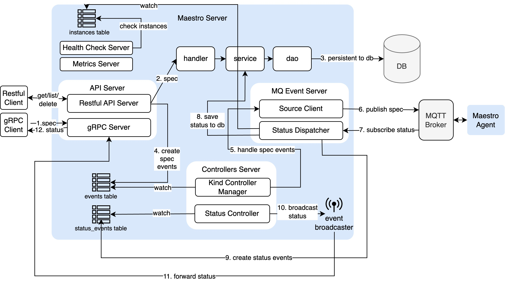
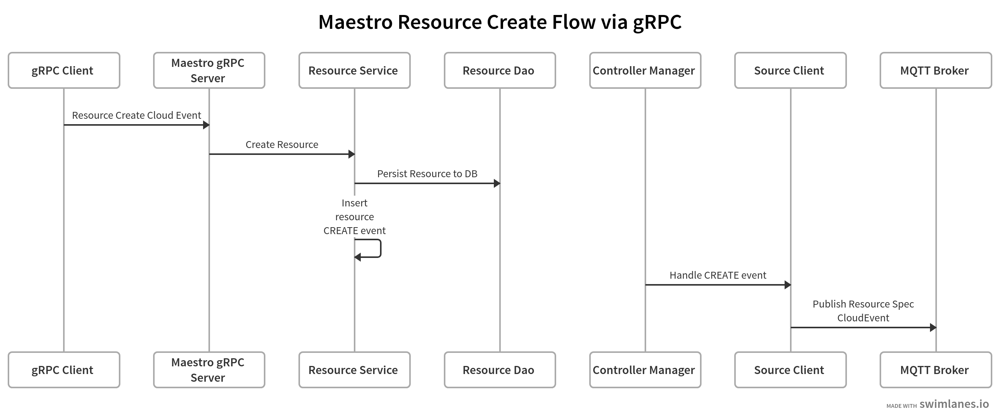
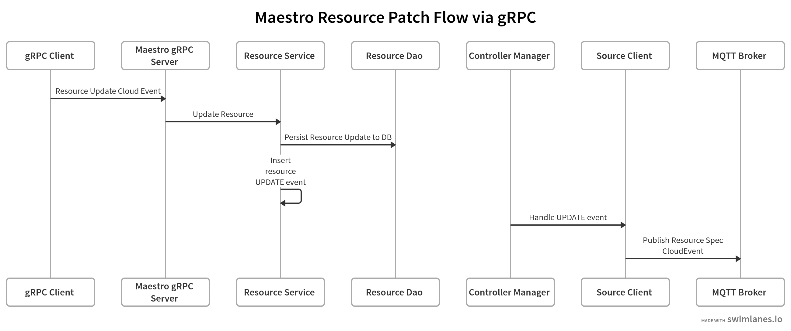
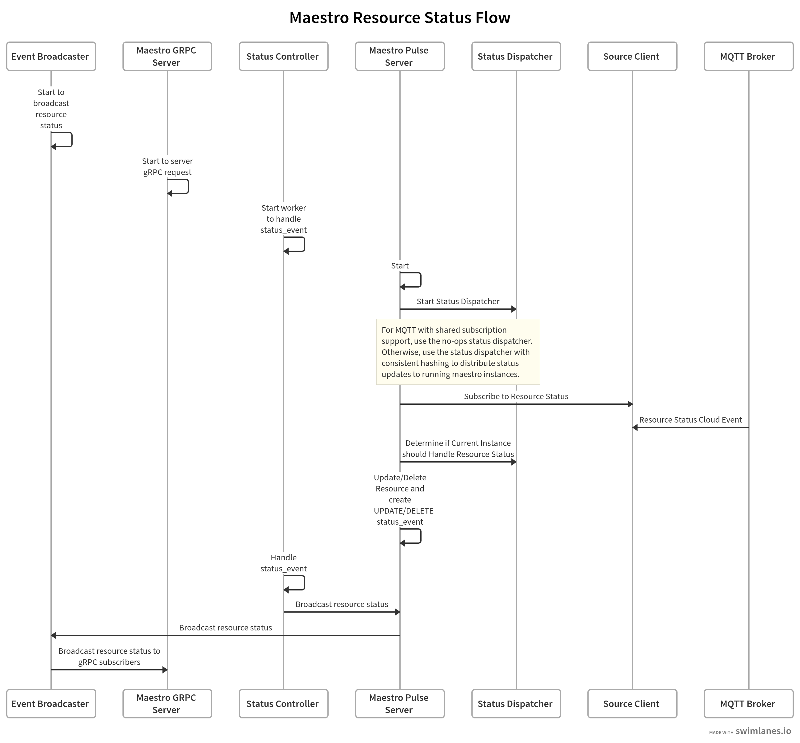
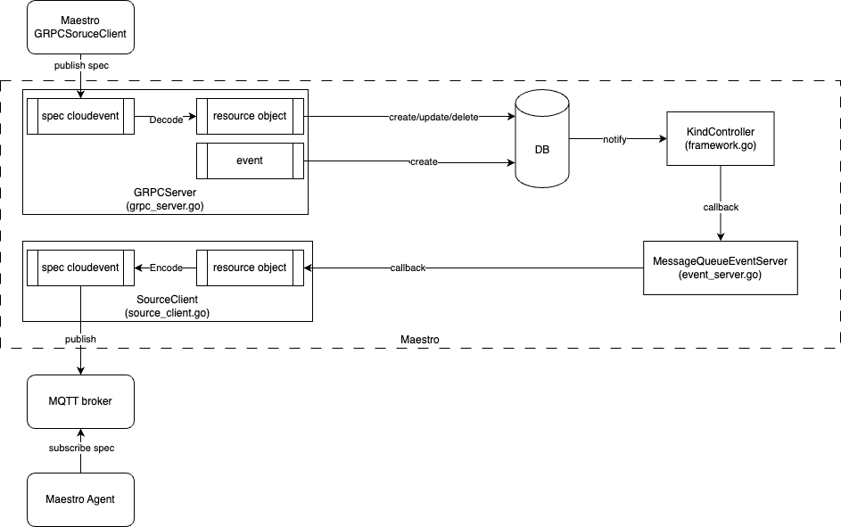
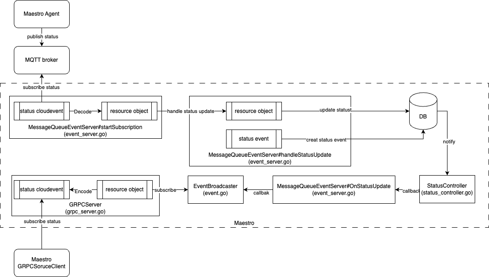

# Overview 

Maestro leverages [CloudEvents](https://cloudevents.io/) to transport Kubernetes resources to target clusters and relay the resource status back. These resources and their statuses are stored and updated in a database. The system is composed of two main parts: the Maestro server and the Maestro agent.

The Maestro Server includes various components to fulfill its functions, as illustrated in the diagram below.



## gRPC server

### Authentication and Authorization

To enable gRPC server-side TLS, specify your server cert and key with `--grpc-tls-cert-file` and `--grpc-tls-key-file`.

For authorization, the gRPC server uses a mock authorizer by default. To enable real authorization, set `--grpc-authn-type` to either `mtls` or `token`. Depending on the authorizer type, you will need to create authorization rule resources, which are standard Kubernetes RBAC resources.

1. mTLS-Based Authorization

For mTLS-based authorization, specify the client CA file using `--grpc-client-ca-file`. The server will validate the client certificate against this CA.

Then create authorization rules based on the `CN (Common Name)` or `O (Organization)` in the client certificate, representing the user or group. For example, to allow the user "Alice" to publish and subscribe to the `policy` source, use the following Kubernetes RBAC configuration:

```yaml
apiVersion: rbac.authorization.k8s.io/v1
kind: ClusterRole
metadata:
  name: policy-pub-sub
rules:
- nonResourceURLs:
  - /sources/policy
  verbs:
  - pub
  - sub
---
apiVersion: rbac.authorization.k8s.io/v1
kind: ClusterRoleBinding
metadata:
  name: policy-pub-sub
roleRef:
  apiGroup: rbac.authorization.k8s.io
  kind: ClusterRole
  name: policy-pub-sub
subjects:
- kind: User
  name: Alice
  apiGroup: rbac.authorization.k8s.io
```

On the gRPC client side, configure the [gRPC options](https://pkg.go.dev/open-cluster-management.io/sdk-go/pkg/cloudevents/generic/options/grpc#GRPCOptions) with the client certificate and key files, as follows:

```golang
grpcOptions = grpcoptions.NewGRPCOptions()
grpcOptions.URL = grpcServerAddr
grpcOptions.CAFile = grpcServerCAFile
grpcOptions.ClientCertFile = grpcClientCertFile
grpcOptions.ClientKeyFile = grpcClientKeyFile
```

The `grpcClientCertFile` and `grpcClientKeyFile` should contain the certificate signed by the client CA. For the example above, the CN must be "Alice".

2. Token-Based Authorization

For token-based authorization, the gRPC server authenticates the client using a Kubernetes service account token. The service account is expected to be created by the gRPC client.

Create authorization rules based on the service account associated with the token. For example, to allow the service account `open-cluster-management/policy-controller` to publish and subscribe to the `policy` source, use the following Kubernetes RBAC configuration:

```yaml
apiVersion: rbac.authorization.k8s.io/v1
kind: ClusterRole
metadata:
  name: policy-pub-sub
rules:
- nonResourceURLs:
  - /sources/policy
  verbs:
  - pub
  - sub
---
apiVersion: rbac.authorization.k8s.io/v1
kind: ClusterRoleBinding
metadata:
  name: policy-pub-sub
roleRef:
  apiGroup: rbac.authorization.k8s.io
  kind: ClusterRole
  name: policy-pub-sub
subjects:
- kind: ServiceAccount
  name: policy-controller
  namespace: open-cluster-management
```

On the gRPC client side, configure the gRPC options with the token file, as follows:

```golang
grpcOptions = grpcoptions.NewGRPCOptions()
grpcOptions.URL = grpcServerAddr
grpcOptions.CAFile = grpcServerCAFile
grpcOptions.TokenFile = grpcClientTokenFile
```

The `grpcClientTokenFile` stores the token for the corresponding service account. In the example above, it holds the token for the `open-cluster-management/policy-controller` service account.

### How to Use gRPC Client

- See [this example](../examples/cloudevents/) for how to use the gRPC client to publish and subscribe to `CloudEvents`.
- See [this example](../examples/manifestwork/) for how to use the `MaestroGRPCSourceWorkClient` client to publish and subscribe to `ManifestWorks`.

## Maestro Resource Flow

1. [Resource create flow with gRPC](https://swimlanes.io/#hZBBDoIwEEX3PcVcwAuwMNGC0QUJQi9QYYKNTWumBa8vBayCJq6aTP+beflCeY0J5BKdJwslOttRjcAJpUc4aPuAXkloy4IzxsIDXCs0HjbbiI3jCqlHSr52cG27BrJ+YBj7QYRFkQkjVQ9GM/z6YGwdWWCptAkUSE45/556C+n+DxkPnoxD8kDRvsx2IgOcvLk1g7bWg24ujWwn7WqOjoUkcJSm0WtykRlLOwsBe7K3UFbRXbRy1w+fO9ZTZWNjTw==)

    

2. [Resource patch flow with gRPC](https://swimlanes.io/#hZDRDoIgGIXveYr/BXoBLtpKbXXhRmoPQPpPWQwcoL1+KEVpbV2xwfkO304lnEQKOUfrjIYCrR5MjcC4qzs4SH2HUXBoC5YQQqYDEilQOdhsIzVfl2hGNPRdcekb7tDH9dBANnqGkB/EVBSZ6UrUXugJvx4IWUcWWMo1BYbGCuu+BJyGdP+nIP57UhaNAxM7WLqrMsCgn2jl7aX01jlXvA32ZYiGXSgcuWrkmlxk5u3OVQV7o2/TZmy4SmG7D58e67DcPNwD)

    

3. [Resource delete flow with gRPC](https://swimlanes.io/#hVBbDoIwEPzvKfYCXoAPPwSMJpoocIEKKzauXbMteH2BxvpM/GoynZmdmcp4wgS2Gp0XhgIdd1IjZEjoEZbEN+iNhrbYpUqp8YGUDFoPs3mUTXCJ0qMkXx4pcddA3g8apX4oRqOoGSFTT4nk/IS1C27Gtkp9kt8MMs0JlHz0j/Px5yh8gWzxRx8DrK1D8SDRON/kVQ4YeqRshxpEQ/yttroNNcpADQMlsNK2oU/lG2cacV9VsBA+j+PtugMZd3rJc8UampclpyHv)

    

## Maestro Resource Status Flow


[maestro-resource-status-flow](https://swimlanes.io/#lVTLUuNADLzPV+gDeNw5bBXYBraKRxbCeWtia+MphhmvpCG/v5rYJinHhMU3S61WS2pbnHi8gHuLLBThCTkmqhGexUpiuPZxY4yp3jEIXFG0TW1ZkOD0BxwEL3IVCUiE1RgFGhl5y2jM2OrmaVHAM9J7zzYT3uPjHrfOScK/SbHGDBqLGLTQ+57nIDiybCK9KkTJWhsaPwr6jXmMnaxF8owzuvbjA+XnRYOI0nFnpW53Ig4SxjxE0QNcR4L7X8slbJy0wK0lbIDTimtynbgY9KXrIskJJG0lLUKIp7HjYQxoPijP4FHTtHGMO/ABqm9Ux8BOb6eHbC23LqzzghQl5FZJPupS11hBzklKIWTc2zC7C4oJNfLZkX30Fii80066i36uFWa+qeWUJe9BffU6WzzFFz6mpjfjtw5Solr2zQUE9weKRJSX8HMYRi8Qk2/gtrfKpOd33fKy3d55iV577siUG2pCTcHLorxcVudldVctq4kz/9fmt3O2ni2eV3n19Tc7HXfmF3CEZfYvMlKv97/7T0myYbZIHi1ESjx5/gE=)



## Maestro Resource Data Flow

### Maestro Publish Resource with MQTT



1. The consumer (e.g., ClustersService) uses the [`MaestroGRPCSourceWorkClient`](../pkg/client/cloudevents/grpcsource/) to create a [`ManifestWork`](./resources/manifestwork.json).

    ```json
    {
      "apiVersion": "work.open-cluster-management.io/v1",
      "kind": "ManifestWork",
      "metadata": {
          "name": "e44ec579-9646-549a-b679-db8d19d6da37",
          ...
      },
      "spec": {
        "workload": {
          "manifests": [
              {
                  "kind": "Deployment",
                  "apiVersion": "apps/v1",
                  "metadata": {
                      "name": "maestro-e2e-upgrade-test",
                      "namespace": "default"
                  },
                  ...
              }
          ]
        }
      }
    }
    ```

    The CS uses the `uuid.NewSHA1(uuid.NameSpaceOID, manifests[0].Name + manifests[0].Namespace + manifests[0].GVK)` to generate the `ManifestWork` name.

2. The `MaestroGRPCSourceWorkClient` sends this `ManifestWork` as a [`CloudEvent`](./resources/cloudevents.grpcclient.json) to the Maestro server via gRPC.

    ```json
    {
      "source": "mw-client-example",
      "type": "io.open-cluster-management.works.v1alpha1.manifestbundles.spec.create_request",
      "datacontenttype": "application/json",
      "data": {...},
      "metadata": "{\"name\":\"e44ec579-9646-549a-b679-db8d19d6da37\",\"uid\":\"55c61e54-a3f6-563d-9fec-b1fe297bdfdb\",...}",
      "resourceid": "55c61e54-a3f6-563d-9fec-b1fe297bdfdb",
      ...
    }
    ```

    - The `MaestroGRPCSourceWorkClient` generates a UID (`uuid.NewSHA1(uuid.NameSpaceOID, sourceID + manifestwork.GR + manifestwork.Namespace + manifestwork.Name)`) for this `ManifestWork` and set the `CloudEvent` `resourceid` extension attribute to this UID.

3. The Maestro server receives this `CloudEvent`, creates a corresponding [`Resource` record](./resources/resource-payload-in-db.md) in its database.

    - Maestro server sets the `resourceid` as the `Resource` record ID
    - Maestro server sets the `CloudEvent` as the `Resource` record payload

4. After persisting the record, the Maestro server publishes a [CloudEvent](./resources/cloudevents.spec.maestro.json) representing the stored Resource to Maestro agent.

5. The Maestro agent receives this CloudEvent, converts it back into a `ManifestWork`, and applies it to the target Kubernetes cluster. After applied, there is a corresponding [appliedmanifestwork](./resources/appliedmanifestwork.json) created on the agent side.

### Maestro Subscribe Resource Status with MQTT



1. The Maestro agent watches the applied ManifestWork status change and publishes a [CloudEvent](./resources/cloudevents.agent.json) representing it.

2. The Maestro server receives the ManifestWork status and updates the corresponding [`Resource` record status](./resources/resource-status-in-db.md) in its database (Maestro server finds the corresponding Resource via CloudEvent resourceid).

3. The Maestro server sends this update using a [CloudEvent](./resources/cloudevents.status.maestro.json). 

4. The MaestroGRPCSourceWorkClient receives this CloudEvent and converts it back to a [ManifestWork](./resources/manifestwork.watched.json).

5. The Consumer watches this updated ManifestWork.
