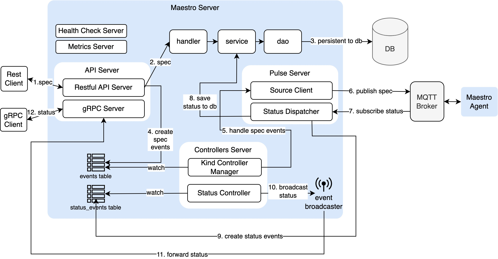
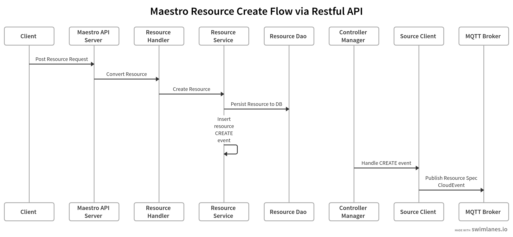
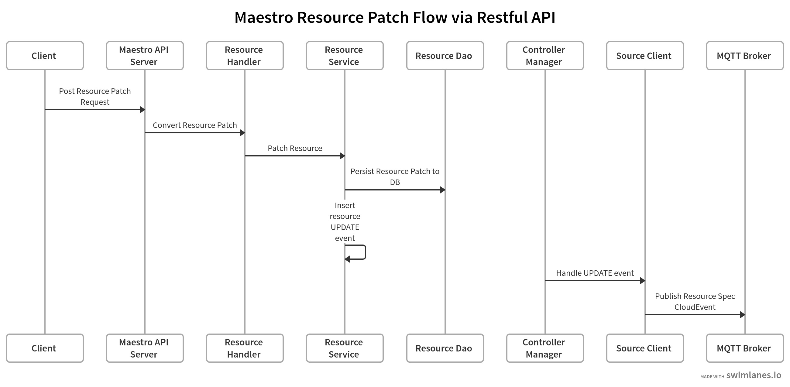
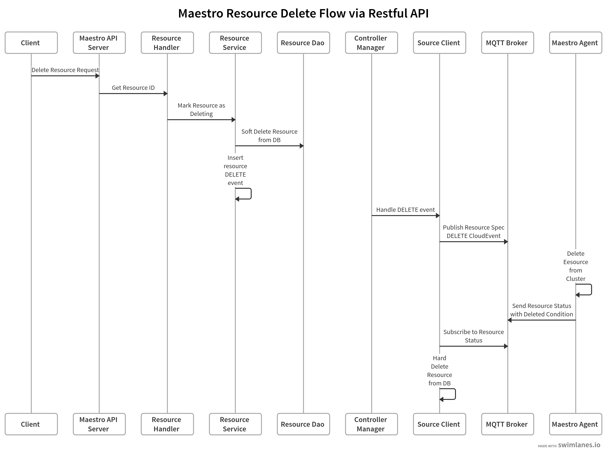
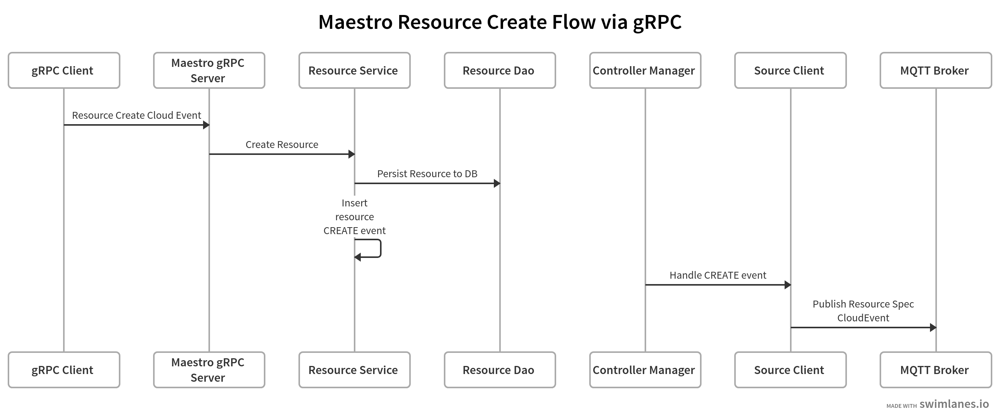
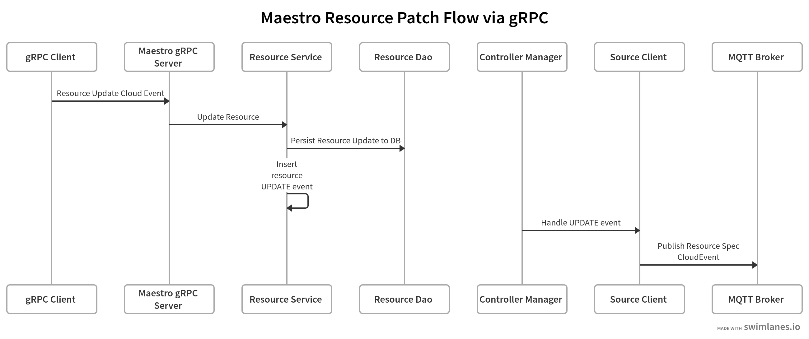
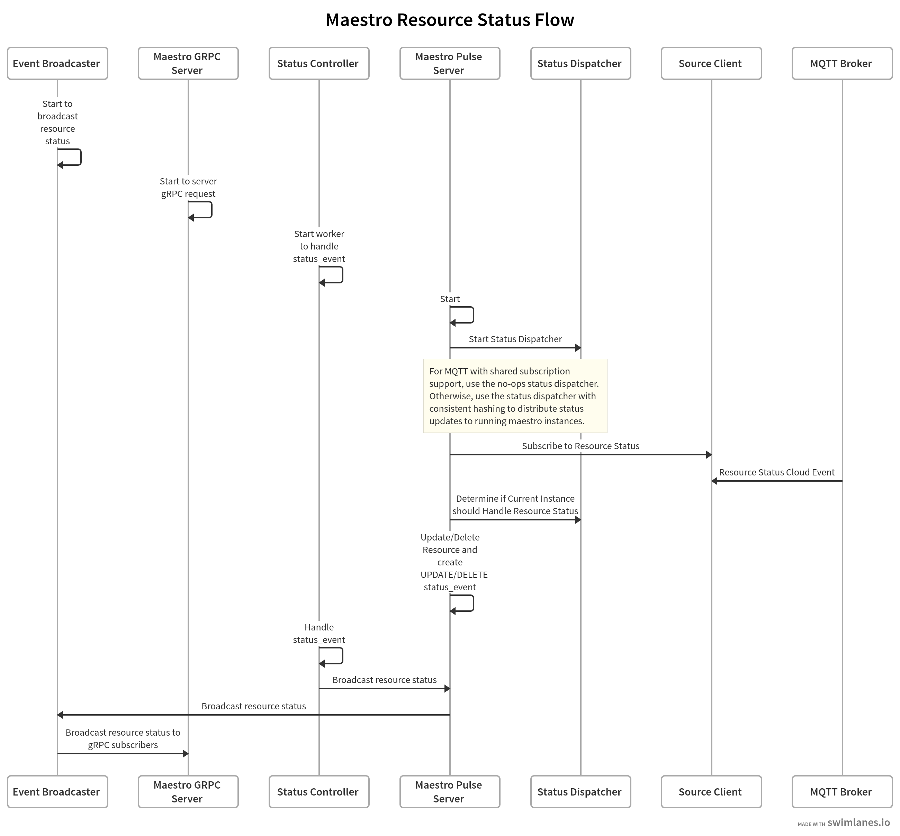

# Overview 

Maestro leverages [CloudEvents](https://cloudevents.io/) to transport Kubernetes resources to target clusters and relay the resource status back. These resources and their statuses are stored and updated in a database. The system is composed of two main parts: the Maestro server and the Maestro agent.

The Maestro Server includes various components to fulfill its functions, as illustrated in the diagram below.

## Maestro Resource Flow

### RESTful API

1. [Resource create flow with restful API](https://swimlanes.io/#hZBNDoIwEEb3PcVcwAuwMAHE6IIEgQtUHLWx6Wh/8PpOkaCoidvOe9NvPq+8xgRKic5bghodBdsh5BalR1hrukOvZBz4Y9CQVlshRK4VGg+L5STyOzRoe7QJVOT8a1ONt8CMEN9oXDBxG2kOOuo5GZ69Ngjxycy8uEp1fMMY+Yc2IjNtJYmTonXqPawnWGV/zOnDrXExp506q4u0LQB77oY7IsPX6hi3lEaenrGbER0KTMaDPswZM5S8a1vILF2GdsNeK3d+y3PFjmEKhyL6Dw==):

    

2. [Resource patch flow with restful API](https://swimlanes.io/#hZBNDoJADIX3c4pewAuwMEHByIIEFQ8wYpWJk6nOD17fDigRXLht3/f6+rzyGhMoJTpvCfboKNgGoZK+aWGj6QmdknHuL0FDWhVCiLVWaDwsliPHczig7dAmUJHzc6M9PgIrhfgFos2o3kpz1tFkTYZ3cx8h5soJHQ1Vw+98jg7zL+qtmFCZJCbQOvWb2xNkqz/8eLUwLka2n8WxytI6B+y4LC6NDD+uY+ZSGnkdsh8G6dBo8v5qRk40feu7uoaVpVtfdzhp5dqvPHdsWEzhnEf+BQ==)

    

3. [Resource delete flow with restful API](https://swimlanes.io/#hZFdboMwEITffYq9QC/AQ6UGaIvUSGngAgYvxIpjt/aaXL/8xeEnVV6XmY+ZMUlSGMGeoyNr4IjOeFshJKiQEN6VuUIref+Baq/g7ZAxxmIlURO8vAZjd4ccbYs2unkD64i/vlMxthX3iKD75FqoHvCBdL9mCWNrycLWk2Q1lLDn+5m7MYjUzQwwiReAhJsIclPTJnltzQWS3RN/CJBph5bABnD6lRYpYNuN1Y1mdFde9fH3XPNmrJGP0nHRaCq4ci40w+rfRQE7a879WgdfKulOszw/WN0IsTJepCMmzN+sH68Z/j21TxftY+UdoX3knofIUYtZAuLkHVwlnSaqgK6+kCSNftYn96WrrCwRyKyRD7ybAa34/x3/AA==)

    

### gRPC

1. [Resource create flow with gRPC](https://swimlanes.io/#hZBBDoIwEEX3PcVcwAuwMNGC0QUJQi9QYYKNTWumBa8vBayCJq6aTP+beflCeY0J5BKdJwslOttRjcAJpUc4aPuAXkloy4IzxsIDXCs0HjbbiI3jCqlHSr52cG27BrJ+YBj7QYRFkQkjVQ9GM/z6YGwdWWCptAkUSE45/556C+n+DxkPnoxD8kDRvsx2IgOcvLk1g7bWg24ujWwn7WqOjoUkcJSm0WtykRlLOwsBe7K3UFbRXbRy1w+fO9ZTZWNjTw==)

    

2. [Resource patch flow with gRPC](https://swimlanes.io/#hZDRDoIgGIXveYr/BXoBLtpKbXXhRmoPQPpPWQwcoL1+KEVpbV2xwfkO304lnEQKOUfrjIYCrR5MjcC4qzs4SH2HUXBoC5YQQqYDEilQOdhsIzVfl2hGNPRdcekb7tDH9dBANnqGkB/EVBSZ6UrUXugJvx4IWUcWWMo1BYbGCuu+BJyGdP+nIP57UhaNAxM7WLqrMsCgn2jl7aX01jlXvA32ZYiGXSgcuWrkmlxk5u3OVQV7o2/TZmy4SmG7D58e67DcPNwD)

    

3. [Resource delete flow with gRPC](https://swimlanes.io/#hVBbDoIwEPzvKfYCXoAPPwSMJpoocIEKKzauXbMteH2BxvpM/GoynZmdmcp4wgS2Gp0XhgIdd1IjZEjoEZbEN+iNhrbYpUqp8YGUDFoPs3mUTXCJ0qMkXx4pcddA3g8apX4oRqOoGSFTT4nk/IS1C27Gtkp9kt8MMs0JlHz0j/Px5yh8gWzxRx8DrK1D8SDRON/kVQ4YeqRshxpEQ/yttroNNcpADQMlsNK2oU/lG2cacV9VsBA+j+PtugMZd3rJc8UampclpyHv)

    

## Maestro Resource Status Flow

[maestro-resource-status-flow](https://swimlanes.io/#lVTLUuNADLzPV+gDeNw5bBXYBraKRxbCeWtia+MphhmvpCG/v5rYJinHhMU3S61WS2pbnHi8gHuLLBThCTkmqhGexUpiuPZxY4yp3jEIXFG0TW1ZkOD0BxwEL3IVCUiE1RgFGhl5y2jM2OrmaVHAM9J7zzYT3uPjHrfOScK/SbHGDBqLGLTQ+57nIDiybCK9KkTJWhsaPwr6jXmMnaxF8owzuvbjA+XnRYOI0nFnpW53Ig4SxjxE0QNcR4L7X8slbJy0wK0lbIDTimtynbgY9KXrIskJJG0lLUKIp7HjYQxoPijP4FHTtHGMO/ABqm9Ux8BOb6eHbC23LqzzghQl5FZJPupS11hBzklKIWTc2zC7C4oJNfLZkX30Fii80066i36uFWa+qeWUJe9BffU6WzzFFz6mpjfjtw5Solr2zQUE9weKRJSX8HMYRi8Qk2/gtrfKpOd33fKy3d55iV577siUG2pCTcHLorxcVudldVctq4kz/9fmt3O2ni2eV3n19Tc7HXfmF3CEZfYvMlKv97/7T0myYbZIHi1ESjx5/gE=)

