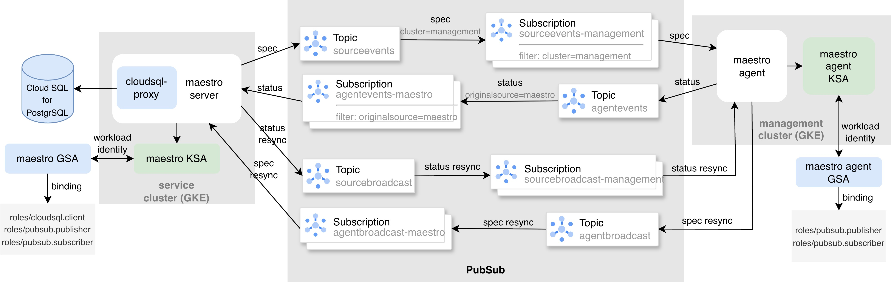

## Setup Maestro in GCP env

This demonstrates how to deploy the Maestro in GCP env.



### Prerequisites

- Install the CLIs: `oc`, `jq`, `gcloud` and plugin `gke-gcloud-auth-plugin`.
- Ensure your `gcloud` CLI is logged in with your GCP account and the GCP account should have the permissions to operate PubSub and Cloud SQL in your provided region
- Export PROJECT_ID, REGION and CONSUMER_ID environment variables

```sh
export PROJECT_ID="<GCP_project_id_not_project_name>" # e.g. gc-acm-dev
export REGION="<GCP_region_for_gke_and_cloudsql>" # e.g. us-east1
export CONSUMER_ID="<consumer_ID_or_name>" # e.g. management
```

- Prepare topics and subscriptions in PubSub service

```sh
make gcp/setup-pubsub
```

- Prepare two GKE clusters with Workload Identity enabled , one is used as Service Cluster and the other is used as Management Cluster, e.g.

```sh
gcloud container clusters create service --region=${REGION} --machine-type=e2-standard-4 --num-nodes=1 --workload-pool=${PROJECT_ID}.svc.id.goog
gcloud container clusters create management --region=${REGION} --machine-type=e2-standard-4 --num-nodes=1 --workload-pool=${PROJECT_ID}.svc.id.goog
```

### Setup Maestro server in your Service Cluster

```sh
export CLUSTER_ID="<your_service_cluster_id>"  # e.g. service
make gcp/setup-maestro
```

This will

- Create Cloud SQL for Maestro server in your region
- Generate service account, grant it roles and bind to maestro server service account
- Deploy maestro server on the given cluster

After maestro server is deployed, you can run following commands to start the Maestro RESTful service and GRPC service in your local host

```sh
oc port-forward svc/maestro 8000 -n maestro
oc port-forward svc/maestro-grpc 8090 -n maestro
```

Then create consumer in maestro server, e.g.

```sh
curl -s -X POST -H "Content-Type: application/json" http://127.0.0.1:8000/api/maestro/v1/consumers -d "{\"name\": \"${CONSUMER_ID}\"}"
```

### Setup Maestro agent in your Management Cluster

```sh
export CLUSTER_ID="<your_management_cluster_id>"  # e.g. management
make gcp/setup-agent
```

This will

- Create service account, grant it roles and bind to maestro agent service account
- Deploy maestro agent on the given cluster

### Cleanup

```sh
export PROJECT_ID="<GCP_project_id_not_project_name>" # e.g. gc-acm-dev
export CONSUMER_ID="<consumer_ID_or_name>" # e.g. management

make gcp/teardown

# delete your gke clusters, e.g.
gcloud container clusters delete service --region=${REGION}
gcloud container clusters delete management --region=${REGION}
```

## Run Maestro e2e on a GCP cluster

### Prepare

1. Install the following CLIs `oc`, `gcloud`, `jq` and [`krelay` plugin](https://github.com/knight42/krelay)
2. Prepare topics and subscriptions in PubSub service

```sh
export PROJECT_ID="<GCP_project_id_not_project_name>"
export REGION="<GCP_region_for_gke_and_cloudsql>"
export CONSUMER_ID="<consumer_ID_or_name>" # e.g. cluster1

make gcp/setup-pubsub
```

3. Create a gke cluster

```sh
gcloud container clusters create maestro-e2e --region=${REGION} --machine-type=e2-standard-4 --num-nodes=1 --workload-pool=${PROJECT_ID}.svc.id.goog
```

### Run e2e

```sh
export PROJECT_ID="<GCP_project_id_not_project_name>"
export REGION="<GCP_region_for_gke_and_cloudsql>"
export CONSUMER_ID="<consumer_ID_or_name>"
export CLUSTER_ID="maestro-e2e"
export KUBECONFIG="$PWD/.kubeconfig"

make gcp/e2e-test
```

### Cleanup

```sh
export PROJECT_ID="<GCP_project_id_not_project_name>"
export CONSUMER_ID="<consumer_ID_or_name>"
make gcp/teardown

# delete your gke clusters, e.g.
gcloud container clusters delete maestro-e2e --region=${REGION}
```
