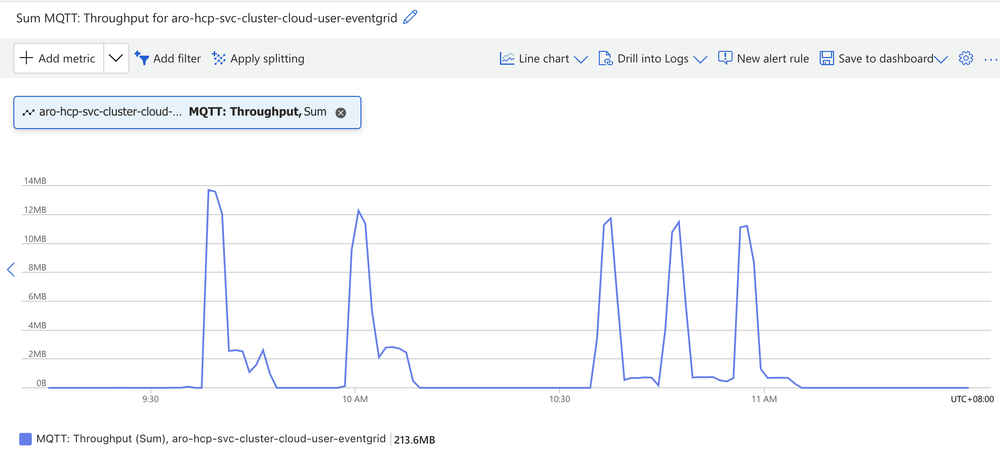

# Performance Test

## Resource usage (ARO HCP)

### Workloads

There are 10 consumers in the maestro server and each consumer has 600 resource bundles, include

- 300 managed cluster resource bundles, each managed cluster resource bundle contains a [ManagedCluster](./pkg/hub/workloads/manifests/aro-hpc/managedcluster.yaml) CR
- 300 manifestworks resource bundles, each manifestworks resource bundle contains two ManifestWork CRs: [namespace](./pkg/hub/workloads/manifests/aro-hpc/manifestwork.namespace.yaml) and [hypershift](./pkg/hub/workloads/manifests/aro-hpc/manifestwork.hypershift.yaml)

And after the resources are applied on the consumer agent part, there is a status simulator to add the mock status for the resources, finally, one resource will have spec and status, the whole sample can be found from [here](https://drive.google.com/file/d/1OXJX_RFsMqvHgVmroR1XiOAU6LrNYF0y/view?usp=sharing) for managed cluster and manifestworks resources.

#### Workload Size

```
total_records=10x300x2=6000

one_managed_cluster_resource_bundles_record_size=3K  (3127, spec=742, status=2067)
one_manifestworks_resource_bundles_record_size=49K (49899, spec=30771, status=18802)
total_size_records_per_consumer=300x3+300x49=15M
total_size_records=15x10=150M
```

### Test Steps

1. Follow [ARO-HCP doc](https://github.com/Azure/ARO-HCP/blob/main/dev-infrastructure/docs/development-setup.md) to deploy maestro in the ARO

2. Add 10 consumers in the maestro 

```sh
counts=10 test/performance/hack/aro-hcp/prepare.consumer.sh
```

3. Prepare a KinD cluster to run consumer agents

```sh
test/performance/hack/aro-hcp/prepare.kind.sh
```

4. Start 10 consumer agents

```sh
# tail -f _output/performance/aro/logs/agents.log
counts=10 test/performance/hack/aro-hcp/start-consumer-agents.sh
```

5. Start a watcher to simulate a controller to update the resource status

```sh
# tail -f _output/performance/aro/logs/watcher.log
counts=10 test/performance/hack/aro-hcp/start-spoke-watcher.sh
```

6. Create resource bundles for two consumers: 1 and 2

```sh
index=9 test/performance/hack/aro-hcp/create-works.sh
index=10 test/performance/hack/aro-hcp/create-works.sh
```

7. Wait the resources are updated on spoke, repeat the step 6 

### Maestro server cpu/memory consumption


### PostgreSQL cpu/memory/storage consumption


```
# PostgreSQL Table Size
total |  records 
-------+---------
15 MB | 1200
27 MB | 2400
40 MB | 3600
52 MB | 4800
65 MB | 6000
```

### Event Grid consumption





### Responsiveness

1. The maestro server resource creation velocity: avg=54r/s, max=93r/s (source client sends 6000 requests with a given QPS(avg=56, max=93) )
2. The maestro server resource status update velocity: avg=2r/s, max=15r/s (10 agents, each agent sync the resource status every 10s)
3. List time consumption

```
# list all resources for one consumer (total resources 6000) 
lists resources (counts=600) from consumer 1, time=3266ms
lists resources (counts=600) from consumer 2, time=3182ms
lists resources (counts=600) from consumer 3, time=3158ms
lists resources (counts=600) from consumer 4, time=3147ms
lists resources (counts=600) from consumer 5, time=3245ms
lists resources (counts=600) from consumer 6, time=3309ms
lists resources (counts=600) from consumer 7, time=3097ms
lists resources (counts=600) from consumer 8, time=4037ms
lists resources (counts=600) from consumer 9, time=3191ms
lists resources (counts=600) from consumer 10, time=3167ms
avg_time=3279ms

# only list managed cluster resource bundles for one consumer (total resources 6000) 
lists resources (counts=300) from consumer 1, time=345ms
lists resources (counts=300) from consumer 2, time=275ms
lists resources (counts=300) from consumer 3, time=279ms
lists resources (counts=300) from consumer 4, time=249ms
lists resources (counts=300) from consumer 5, time=272ms
lists resources (counts=300) from consumer 6, time=335ms
lists resources (counts=300) from consumer 7, time=313ms
lists resources (counts=300) from consumer 8, time=281ms
lists resources (counts=300) from consumer 9, time=295ms
lists resources (counts=300) from consumer 10, time=298ms
avg_time=294ms

# only list hyper shift resource bundles for one consumer (total resources 6000) 
lists resources (counts=300) from consumer 1, time=2915ms
lists resources (counts=300) from consumer 2, time=2707ms
lists resources (counts=300) from consumer 3, time=3455ms
lists resources (counts=300) from consumer 4, time=2842ms
lists resources (counts=300) from consumer 5, time=2741ms
lists resources (counts=300) from consumer 6, time=2741ms
lists resources (counts=300) from consumer 7, time=2820ms
lists resources (counts=300) from consumer 8, time=2794ms
lists resources (counts=300) from consumer 9, time=3070ms
lists resources (counts=300) from consumer 10, time=2851ms
avg_time=2893ms

# list all (total resources 6000)
lists resources 1200 from 2 consumers, time=6643ms
lists resources 1800 from 3 consumers, time=9452ms
lists resources 2400 from 4 consumers, time=12864ms
lists resources 3000 from 5 consumers, time=15584ms
lists resources 3600 from 6 consumers, time=17807ms
lists resources 4200 from 7 consumers, time=20371ms
lists resources 4800 from 8 consumers, time=22623ms
lists resources 5400 from 9 consumers, time=25392ms
lists resources 6000 from 10 consumers, time=28377ms
```

## Apply Time (ARO HCP)

### Workloads

There is 1 consumer in the maestro server and we apply 600 resource bundles in it, include

- 300 managed cluster resource bundles, each managed cluster resource bundle contains a [ManagedCluster](./pkg/hub/workloads/manifests/aro-hpc/managedcluster.yaml) CR
- 300 manifestworks resource bundles, each manifestworks resource bundle contains two ManifestWork CRs: [namespace](./pkg/hub/workloads/manifests/aro-hpc/manifestwork.namespace.yaml) and [hypershift](./pkg/hub/workloads/manifests/aro-hpc/manifestwork.hypershift.yaml)

And after the resources are applied on the consumer agent part, there is a status simulator to add the mock status for the resources, finally, one resource will have spec and status, the whole sample can be found from [here](https://drive.google.com/file/d/1OXJX_RFsMqvHgVmroR1XiOAU6LrNYF0y/view?usp=sharing) for managed cluster and manifestworks resources.

### Test Steps

1. Follow [ARO-HCP doc](https://github.com/Azure/ARO-HCP/blob/main/dev-infrastructure/docs/development-setup.md) to deploy maestro in the ARO

2. Add 1 consumer in the maestro 

```sh
test/performance/hack/aro-hcp/prepare.consumer.sh
```

3. Prepare a KinD cluster to run consumer agents

```sh
test/performance/hack/aro-hcp/prepare.kind.sh
```

4. Start 1 consumer agents

```sh
test/performance/hack/aro-hcp/start-consumer-agents.sh
```

5. Start a watcher to simulate a controller to update the resource status

```sh
test/performance/hack/aro-hcp/start-spoke-watcher.sh
```

6. Perform three rounds of tests, each creating 600 workloads in fixed intervals: 20 every 30s, 50 every 30s, and 100 every 30s.

### Test Result

The applied time (in ms) of a resource equals the timestamp of its first status return to the Maestro server minus the timestamp of its publication from the Maestro server.

All test data can be found from [here](https://docs.google.com/spreadsheets/d/19GsECb9CKpdz98KnRs6UpgXxDXGXLCo75g0u9PovuiU/edit?usp=sharing)

#### Round 1 (20 every 30s)

##### Total avg applied time

|Applied Resources|AVG Applied Time(ms)|
|:-------------:|:--------------:|
|20|759|
|40|833|
|60|875|
|80|937|
|100|1061|
|120|1286|
|140|1451|
|160|1579|
|180|1673|
|200|1750|
|220|1811|
|240|1861|
|260|1905|
|280|1943|
|300|1974|
|320|2001|
|340|2027|
|360|2050|
|380|2069|
|400|2087|
|420|2101|
|440|2117|
|460|2131|
|480|2144|
|500|2154|
|520|2164|
|540|2173|
|560|2181|
|580|2212|
|600|2233|

##### Each period avg applied time

|Applied Resources|AVG Applied Time(ms)|
|:-------------:|:--------------:|
|20|759|
|20|907|
|20|957|
|20|1126|
|20|1558|
|20|2409|
|20|2444|
|20|2474|
|20|2423|
|20|2440|
|20|2422|
|20|2407|
|20|2443|
|20|2438|
|20|2395|
|20|2413|
|20|2441|
|20|2446|
|20|2411|
|20|2423|
|20|2385|
|20|2460|
|20|2427|
|20|2438|
|20|2415|
|20|2395|
|20|2408|
|20|2403|
|20|3072|
|20|2850|

#### Round 2 (50 every 30s)

##### Total avg applied time

|Applied Resources|AVG Applied Time(ms)|
|:-------------:|:--------------:|
|50|2812|
|100|3019|
|150|3626|
|200|3876|
|250|4028|
|300|4109|
|350|4187|
|400|4235|
|450|4122|
|500|4198|
|550|4285|
|600|4354|

##### Each period avg applied time

|Applied Resources|AVG Applied Time(ms)|
|:-------------:|:--------------:|
|50|2812|
|50|3227|
|50|4840|
|50|4624|
|50|4640|
|50|4513|
|50|4655|
|50|4573|
|50|3214|
|50|4883|
|50|5159|
|50|5105|

#### Round 3 (100 every 30s)

##### Total avg applied time

|Applied Resources|AVG applied Time(ms)|
|:-------------:|:--------------:|
|100|6763|
|200|7577|
|300|7598|
|400|7588|
|500|7745|
|600|7874|

##### Each period avg applied time

|Applied Resources|AVG Applied Time(ms)|
|:-------------:|:--------------:|
|100|6763|
|100|8392|
|100|7638|
|100|7559|
|100|8372|
|100|8521|
